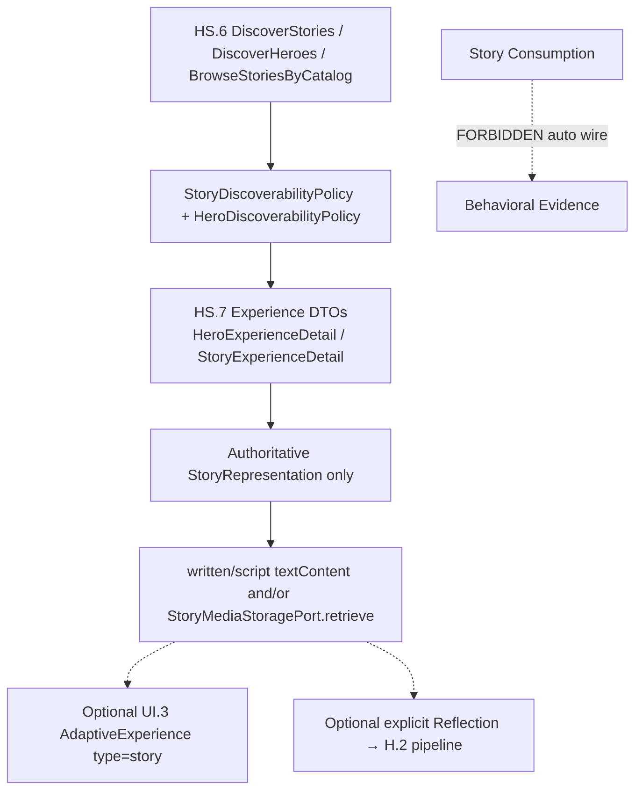

# HS.7 — Architecture Decision Lock

**Phase:** HS.7 — Hero Experience  
**Document type:** Decision validation / architecture lock (no implementation)  
**Date:** 2026-09-12  
**Branch context:** Validated against `main` @ `625e3b1` (HS.6 merged).  
**Related plan:** `docs/architecture/HS.7-Hero-Experience-Plan.md` (planning PR; not yet on `main` at lock time — content inspected from `origin/cursor/hs7-hero-experience-plan-fd6a`).  

**Constraint honored:** Inspect → Validate → Document → Lock. No HS.7 production code, domain objects, refactors, or new tests were added by this task.

---

## Verdict (top line)

| Question | Answer |
|----------|--------|
| Can D1–D16 be locked? | **Yes — all 16 are APPROVED as architectural constraints**, with **three clarifications** that constrain *how* implementation proceeds (not whether the decisions stand). |
| Hard-stop conflicts requiring STOP? | **None** that force new aggregates, duplicate discovery, personalization, collections, social, or evidence-from-consumption. |
| Blocking human approvals before coding? | **Yes — see §G** (narrative exposure in experience DTOs; UI.3 begin-path for `ExperienceType.story`; optional Today’s Experience story candidate rule; unlisted known-id policy confirmation). |

---

## A. Repository Findings

### A.1 HS.6 Discovery (EXISTS on `main`)

| Capability | Exact symbol | Path |
|------------|--------------|------|
| Discover Stories | `DiscoverStoriesUseCase` | `lib/features/hero_story/application/use_cases/discover_stories_use_case.dart` |
| Discover Heroes | `DiscoverHeroesUseCase` | `…/discover_heroes_use_case.dart` |
| Catalog browse | `BrowseStoriesByCatalogUseCase` | `…/browse_stories_by_catalog_use_case.dart` |
| Known-id discovery summary | `GetStoryDiscoverySummaryUseCase` | `…/get_story_discovery_summary_use_case.dart` |
| Low-level search | `SearchStoriesUseCase` / `SearchHeroesUseCase` | Pass-through of caller query (no discovery defaults) |
| Story summary DTO | `StoryDiscoverySummary` | Excludes narrative body, unapproved text, media URIs |
| Hero summary DTO | `HeroDiscoverySummary` | Profile-safe fields; no `geographicContext` today |
| Providers | `discoverStoriesUseCaseProvider`, `discoverHeroesUseCaseProvider`, `browseStoriesByCatalogUseCaseProvider`, `getStoryDiscoverySummaryUseCaseProvider`, search/port providers | `application/providers/…` |

**DiscoverStories eligibility (hard-coded in use case):**

- `publishedOnly: true`
- `visibilities: StoryDiscoverabilityPolicy.discoverableVisibilityList`
- `authoritativeRepresentationsOnly: true`
- Post-hydrate re-check of `StoryDiscoverabilityPolicy` + `HeroDiscoverabilityPolicy`
- Supports `heroId` filter on `DiscoverStoriesRequest` (**EXISTS**)

**GetStoryDiscoverySummaryUseCase:** fail-closed for missing / non-discoverable story or non-discoverable hero (including unlisted/private). Tested.

**GetHeroDiscoverySummaryUseCase:** **DOES NOT EXIST** (Hero experience detail must be proposed in HS.7 application layer, gated by `HeroDiscoverabilityPolicy`).

### A.2 Discoverability policies (EXISTS)

`StoryDiscoverabilityPolicy.isDiscoverable`:

1. `lifecycleStatus == published`
2. `visibility ∈ {public, community}`
3. `!hasProvisionalNarrative`

`HeroDiscoverabilityPolicy.isDiscoverable`:

1. `status == active`
2. `visibility ∈ {public, community}`

**Authoritative ADR support:** HS-ADR-041…047 (especially 043 visibility, 044 authoritative representations, 047 derived summaries).

### A.3 Search substrate risk (EXISTS — must not be misused by HS.7)

- `StorySearchQuery.visibilities` defaults to `[]` (adapter applies visibility filter only when non-empty).
- `SearchStoriesUseCase` does **not** apply discoverability policy.
- Therefore **HS.7 seeker paths must call Discover\*** (or equivalently force policy fields), never raw Search\* / repository reads for presentation.

### A.4 Story / Representation / Media (EXISTS)

| Item | Fact |
|------|------|
| `StoryRepresentation.isAuthoritative` | `!isAiGenerated \|\| isApproved` |
| Formats | `audio`, `video`, `written`, `transcript`, `script`, `shortForm`, `longForm` |
| Content fields | `textContent?`, `mediaReference?` |
| `StoryMediaStoragePort` | `store` / `exists` / `retrieve` / `delete` + in-memory adapter |
| Hero → Stories | **Not** stored on Hero; `Story.heroId` + `StoryRepository.findByHeroId` (**unfiltered**) |
| Seeker GetStory/GetHero detail | **DOES NOT EXIST** |
| Authoring use cases | Load full `Story` by id **without** discoverability (creator/admin path — not seeker Experience) |

### A.5 UI.3 Adaptive Experience (EXISTS)

| Item | Fact |
|------|------|
| `AdaptiveExperience` | `id`, `type`, `title`, `description`, `action`, `rationale?` |
| `ExperienceType` | includes **`story`** |
| `ExperienceSelectionService.selectFor(Journey)` | Port EXISTS |
| `DeterministicExperienceSelectionService` | Returns **`ExperienceType.reflection` only** — never `story` |
| `GetTodayExperienceUseCase` | Uses selection service |
| `BeginExperienceUseCase` / `DefaultBeginExperienceUseCase` | On `ExperienceAction.begin`, **always creates a Reflection** via `CreateReflectionUseCase` |
| Presentation | `HomeScreen` → `ExperienceScreen` → Begin → `ReflectScreen` |
| `DiscoverScreen` | Life-meaning prompts — **not** Hero/Story catalog |

### A.6 H.2 Reflection → Evidence (EXISTS)

```text
SubmitReflectionUseCase
  → ReflectionSubmitted
  → ReflectionSubmittedReactor
  → AnalyzeReflectionUseCase
  → BehavioralEvidenceDetected
  → BehavioralEvidenceDetectedReactor
  → DetectPatternUseCase
  → BehaviorPatternsDetected
```

**HS-ADR-011 (Accepted):** Story interaction does **not** automatically constitute Behavioral Evidence.

### A.7 Events / social / collections

| Concept | Status |
|---------|--------|
| StoryViewed / StoryConsumed / StoryPlayed | **DOES NOT EXIST** |
| Collections / saves / likes / follows | **DOES NOT EXIST** in `hero_story` |
| `hero_story/presentation/` | **DOES NOT EXIST** |

### A.8 HS.7 plan document

Planning content exists on `origin/cursor/hs7-hero-experience-plan-fd6a` as `docs/architecture/HS.7-Hero-Experience-Plan.md`. Not merged to `main` at lock time. This lock document is the decision authority for implementation start; the plan remains the detailed slice guide once merged or cherry-picked.

---

## B. Decision Validation (D1–D16)

### D1 — Story Experience flow (Discover → Detail → Consume via DTOs)

| Field | Value |
|-------|--------|
| **Status** | **APPROVED** |
| **Evidence** | Discover\* EXISTS; seeker detail use case DOES NOT EXIST (expected gap); no requirement for new aggregate to add DTO use cases. |
| **Implementation impact** | Add application `GetStoryExperienceUseCase` + `StoryExperienceDetail` DTO; presentation consumes DTOs only. |

### D2 — Narrative exposure only via authoritative representation / gated experience DTO

| Field | Value |
|-------|--------|
| **Status** | **APPROVED** (implementation requires human confirmation of narrative-in-DTO — §G) |
| **Evidence** | HS.6 summaries intentionally omit narrative; `isAuthoritative` EXISTS; unapproved AI text must stay out of playable projection. |
| **Implementation impact** | Experience detail may include canonical narrative **only after** discoverability gate; playable reps = authoritative only; never expose understanding proposals. |

### D3 — Deterministic representation selection (no personalization)

| Field | Value |
|-------|--------|
| **Status** | **APPROVED** |
| **Evidence** | HS-ADR-044/045; Discover\* already forces `authoritativeRepresentationsOnly: true`; no ranking code in HS.6. |
| **Implementation impact** | Documented language/format priority cascade; no ML/embeddings. |

### D4 — Reuse HS.6 discoverability; no known-id bypass

| Field | Value |
|-------|--------|
| **Status** | **APPROVED** |
| **Evidence** | Policies + GetStoryDiscoverySummary fail-closed; discoverable = `{public, community}` only. Repository/Search can load non-discoverable aggregates but are **not** seeker Experience APIs. |
| **Implementation impact** | HS.7 Experience use cases must re-apply policies. **Do not** add unlisted-by-known-id seeker access without separate approval. Do not call `SearchStoriesUseCase` for seeker UI without discovery defaults. |

### D5 — Discovery reuse (no duplicate search)

| Field | Value |
|-------|--------|
| **Status** | **APPROVED** |
| **Evidence** | Discover\*/Browse\*/ports/providers EXISTS; HS-ADR-042 forbids StoryDiscovery aggregate. |
| **Implementation impact** | HS.7 lists call Discover\*; Hero’s Stories use `DiscoverStoriesRequest(heroId: …)` (preferred) rather than unfiltered `findByHeroId`. |

### D6 — Hero Experience (Profile → Stories → Story Experience) via DTOs

| Field | Value |
|-------|--------|
| **Status** | **APPROVED** |
| **Evidence** | `DiscoverHeroesUseCase` + `HeroDiscoverySummary` EXISTS; `heroId` filter on DiscoverStories EXISTS; Hero does not embed stories. |
| **Implementation impact** | Add `GetHeroExperienceUseCase` + DTO (may include `geographicContext` absent from discovery summary); never pass `Hero` aggregate to widgets. |

### D7 — No structured Hero Journey aggregate

| Field | Value |
|-------|--------|
| **Status** | **APPROVED** |
| **Evidence** | No HeroJourney types in repo; Foundation warns Hero chronology ≠ Life Journey; plan recommends Stories list only. |
| **Implementation impact** | Ordered discoverable stories listing only; no HeroJourney repository/events/persistence. |

### D8 — Consumption via existing media port; no playback aggregate/streaming

| Field | Value |
|-------|--------|
| **Status** | **APPROVED** |
| **Evidence** | `StoryMediaStoragePort.retrieve` EXISTS; formats include `written`/`script`; no playback aggregate/events. |
| **Implementation impact** | Text/script consume first; media bytes via existing port; ephemeral UX state only. |

### D9 — Consumption ≠ Behavioral Evidence

| Field | Value |
|-------|--------|
| **Status** | **APPROVED** |
| **Evidence** | HS-ADR-011; no StoryConsumed events; evidence pipeline starts at Reflection submit. |
| **Implementation impact** | No wiring from consume/complete to evidence/pattern/journey progress. |

### D10 — Minimal UI.3 integration; do not redesign UI.3

| Field | Value |
|-------|--------|
| **Status** | **APPROVED** with **NEEDS CLARIFICATION** on begin-path mechanism (§G) |
| **Evidence** | `ExperienceType.story` EXISTS; selector never returns story; `BeginExperienceUseCase` **always creates Reflection** — incompatible with naive “Begin story through existing BeginExperience” without a branch or alternate navigation. |
| **Implementation impact** | **Preferred locked approach:** primary HS.7 entry = Hero Experience UI (catalog → detail → consume), which does **not** require changing BeginExperience. Optional Slice later: story AdaptiveExperience candidate + **either** type-branched BeginExperience **or** story-specific begin use case that does not auto-create Reflection. Must not fork a second Adaptive Experience framework. |

### D11 — Optional explicit reflection bridge into H.2

| Field | Value |
|-------|--------|
| **Status** | **APPROVED** |
| **Evidence** | Reflection create/submit/analysis pipeline EXISTS; BeginExperience already creates reflections for reflection experiences. |
| **Implementation impact** | Post-consume CTA may start existing reflection flow; do not auto-trigger on consume; no HS.7 Reflection aggregate. |

### D12 — Collections deferred

| Field | Value |
|-------|--------|
| **Status** | **APPROVED** |
| **Evidence** | No collection/save domain in `hero_story`. |
| **Implementation impact** | Implement nothing collection-related in HS.7. |

### D13 — No social/feed features

| Field | Value |
|-------|--------|
| **Status** | **APPROVED** |
| **Evidence** | No likes/follows/comments/feeds in `hero_story`. |
| **Implementation impact** | Out of scope entirely. |

### D14 — HS.8 boundary (no personalization / semantic ranking)

| Field | Value |
|-------|--------|
| **Status** | **APPROVED** |
| **Evidence** | HS-ADR-041; Discover\* is non-personalized; selector is deterministic reflection-only. |
| **Implementation impact** | Any story candidate for UI.3 must be deterministic non-personalized. |

### D15 — No new aggregates for Experience/Playback/Journey/Collection/Consumption

| Field | Value |
|-------|--------|
| **Status** | **APPROVED** |
| **Evidence** | Existing Hero/Story/Representation + discovery + UI.3 models suffice; hard-stop rule satisfied without new aggregates. |
| **Implementation impact** | Application DTOs + use cases + presentation state only. |

### D16 — No new domain events for viewed/opened/played/consumed

| Field | Value |
|-------|--------|
| **Status** | **APPROVED** |
| **Evidence** | No such events today; adding them risks evidence coupling. |
| **Implementation impact** | Do not add consume telemetry domain events in HS.7 MVP. |

---

## C. Validated HS.7 Architecture

### C.1 Locked flow



### C.2 Explicit non-edge

```text
Story Consumption  ──X──>  BehavioralEvidence
Story Consumption  ──X──>  BehaviorPattern
Story Consumption  ──X──>  Discovery Profile mutation
Story Consumption  ──X──>  Mission/Journey progress
```

Evidence enters **only** via existing Reflection (or other Life Journey actions), never from playback alone.

### C.3 Primary vs optional entry

| Entry | Locked stance |
|-------|----------------|
| Hero/Story Experience UI | **Primary** for HS.7 MVP |
| Today’s Experience (`ExperienceType.story`) | **Optional later slice**; requires begin-path clarification (§G) |
| Life `DiscoverScreen` | **Do not overload** without product approval (different concept) |

---

## D. Aggregate / Repository / Event Impact

### Reused (EXISTS)

- Aggregates: `Hero`, `Story` (+ `StoryRepresentation` entity), `StoryUnderstanding` (not exposed in Experience)
- Ports: `StorySearchPort`, `HeroSearchPort`, `StoryMediaStoragePort`
- Policies: `StoryDiscoverabilityPolicy`, `HeroDiscoverabilityPolicy`
- Use cases: Discover\*, Browse\*, GetStoryDiscoverySummary, Search\* (admin/low-level only — not seeker Experience)
- UI.3: `AdaptiveExperience`, `ExperienceSelectionService`, reflection pipeline
- Repositories: `HeroRepository`, `StoryRepository` (behind application use cases only)

### NOT created in HS.7

| Kind | Forbidden examples |
|------|--------------------|
| Aggregates | `StoryExperience`, `Playback`, `HeroJourney`, `Collection`, `Consumption`, `SavedStory` |
| Repositories | Any for the above |
| Ports | Duplicate search; production streaming; semantic/vector search |
| Domain events | `StoryViewed`, `StoryConsumed`, `StoryPlayed`, `HeroViewed` (MVP) |
| Persistence | Playback progress DB; collections tables |

---

## E. Boundary Verification

| Context | HS.7 may | HS.7 must not |
|---------|----------|---------------|
| Hero & Story | Experience DTOs, consume authoritative content, presentation | Personalization, evidence interpretation |
| Discovery (person BC) | Reference `NarrativeThemeId` already on Story | Own Story search; mutate Discovery Profile from playback |
| HS.6 Discovery APIs | Compose/reuse | Replace with parallel search |
| Life Journey | Optional explicit reflection entry | Auto-evidence from consume; Journey progress from listen |
| UI.3 | Optional story AdaptiveExperience mapping | Second experience framework; selector personalization |
| HS.8 | Nothing | Ranking, embeddings, adaptive discovery |

**Confirmed:** Locked HS.7 does **not** absorb HS.8, Discovery personalization, or Life Journey evidence ownership.

---

## F. Risks / Conflicts / Guardrails

| Finding | Severity | Guardrail |
|---------|----------|-----------|
| `SearchStoriesUseCase` can return published private/unlisted ids if `visibilities` empty | Medium | HS.7 seeker code uses **Discover\*** only |
| `StoryRepository.findById` / `findByHeroId` unfiltered | Medium | Never call from presentation; Experience use cases enforce policy |
| Authoring use cases return full `Story` | Low (admin path) | Keep out of seeker Experience providers |
| `BeginExperienceUseCase` always creates Reflection | **High for UI.3 story begin** | Do not route story consume through BeginExperience until type-branch approved; primary UI entry avoids this |
| `DeterministicExperienceSelectionService` never returns `story` | Expected | Optional later deterministic candidate only |
| HS.7 plan not on `main` yet | Process | Merge/cherry-pick plan with or before implementation PR |
| Analyzer infos on HS.4/HS.5 files | Pre-existing | Unrelated to HS.7 lock |

**No hard-stop:** No requirement discovered that forces new aggregates, duplicate discovery, personalized ranking, collections, social features, AI integration, or automatic evidence from consumption.

---

## G. Human Approvals Required Before Implementation Coding

| ID | Topic | Locked decision | Still needs explicit OK to code |
|----|-------|-----------------|--------------------------------|
| A1 | Narrative in `StoryExperienceDetail` | Allowed **only** after discoverability gate; never unapproved reps | **Yes** — confirm narrative body (vs title-only) for MVP |
| A2 | UI.3 begin-path for `ExperienceType.story` | Must not auto-create Reflection | **Yes** — choose: (1) UI-only entry first, or (2) branch BeginExperience, or (3) story-specific begin use case |
| A3 | Today’s Experience may select story | Optional; deterministic only | **Yes** — include in MVP or defer to later slice |
| A4 | Unlisted known-id Experience | **Forbidden** in HS.7 without new ADR | **Yes** — confirm remain forbidden |
| A5 | Nav surface | New Heroes/Stories UI; don’t overload life Discover | **Yes** — product nav placement |
| A6 | Language/format priority table | Deterministic cascade required | **Yes** — confirm priority order |

**No new approval needed to preserve:** HS-ADR-011, HS-ADR-041…047, discoverability `{public, community}`, authoritative representation rule, collections/social/HS.8 exclusions, no new aggregates/events for consume.

---

## H. Baseline Validation (this lock task)

| Check | Result |
|-------|--------|
| `dart analyze` | **No errors/warnings** — 9 pre-existing `prefer_initializing_formals` **info**s in HS.4/HS.5 files only |
| HS.6 focused tests (`hs6_hero_story_discovery_test`, `hs6_discoverability_policy_test`, `search_adapters_test`) | **Pass** |
| UI.3 focused tests (selection, today experience, begin experience, today provider/view model, experience screen) | **Pass** |
| Combined focused run | **53/53 passed** |
| Code changes for HS.7 | **None** (docs-only lock) |

---

## I. Implementation Boundaries for Next Phase (when approved)

**In scope (after §G approvals):**

1. Application experience DTOs + discoverability-gated Get\*Experience use cases  
2. Presentation under `hero_story/presentation` for catalog/profile/detail/consume  
3. Authoritative representation resolution + text/script consume; media via `StoryMediaStoragePort`  
4. Reuse Discover\* for lists; `heroId` filter for Hero’s Stories  
5. Optional explicit reflection CTA into existing H.2 pipeline  
6. Optional later UI.3 story mapping **only** with approved begin-path  

**Out of scope:**

- Collections, social, HS.8 ranking/semantic search  
- HeroJourney / Playback / Experience / Consumption aggregates  
- Consume domain events  
- Unlisted known-id seeker access  
- Playback persistence / streaming platform  
- Redesign of UI.3 or duplicate discovery  

---

## J. Decision Lock Statement

Effective with this document:

> **D1–D16 are locked as the architectural constraints for HS.7 implementation**, subject to the clarifications and human approvals in §G.  
> Implementation must not begin until A1–A6 in §G are explicitly decided.  
> Any change that would require a hard-stop item in the task brief must STOP and re-open this lock.

---

*End of HS.7 Architecture Decision Lock.*
