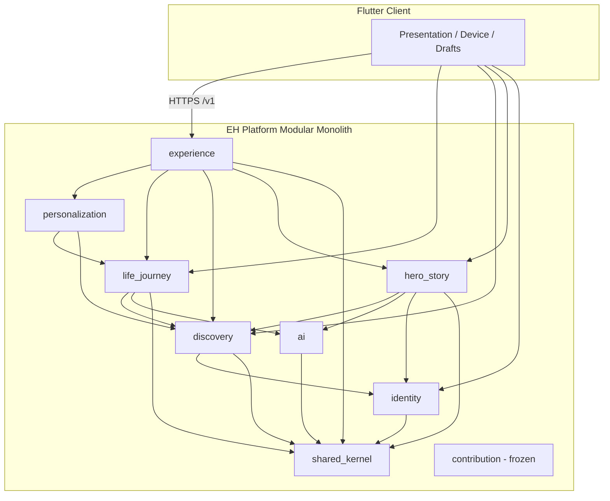
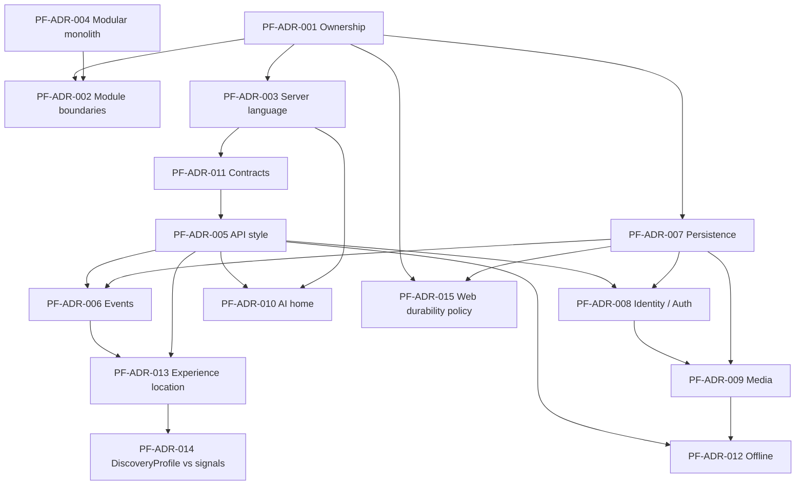

# PF.2 — EH Platform Architecture Decisions & Contracts

**Document type:** Platform Foundation Planning (PF.2)  
**Status:** Implementation-ready platform architecture decisions (planning only)  
**Date:** 2026-09-23  
**Baseline:** PF.1 `docs/architecture/Everyone's-Heroes-Overall-Architecture.md` (`main` @ `059e17c`, post PF.1 merge; code baseline originally inspected by PF.1 at `1f59d30`)  
**Scope:** Planning only — **no application implementation** authorized by this document

---

## 1. Purpose

PF.2 turns the PF.1 architectural decision backlog into a concrete, implementation-ready platform architecture for Everyone’s Heroes (EH).

It answers:

1. What becomes authoritative on the future **EH Platform**?
2. What remains on the **Flutter client**?
3. What are the **command/query/event/persistence/AI/offline** contracts?
4. Which PF ADRs are **decided**, which need **product input**, and which need **technical investigation**?
5. What is the **migration sequence** from today’s client-owned domain to a modular-monolith platform?

### Constraints of this phase (PF.2)

This document is a **planning artifact**.

It does **not** authorize:

* writing Rust or scaffolding a backend
* modifying Dart / Flutter application code
* adding dependencies or changing `pubspec.yaml`
* creating API endpoints or database schemas
* migrating persistence
* refactoring architecture, moving/deleting/renaming production files
* modifying tests or changing runtime behavior

The only intended repository change for PF.2 is this document.

### Source-of-truth discipline

Every major claim is classified as one of:

| Classification | Meaning |
|----------------|---------|
| **Current implementation** | Verified in repository code |
| **Existing documented decision** | Accepted ADR / AGENTS contract still in force |
| **Proposed decision** | PF.2 recommendation for future implementation phases |
| **Open decision** | Insufficient evidence; needs product or technical input |
| **Inference** | Reasonable extrapolation; not proven by code |

When code and documentation disagree, discrepancies are named explicitly. Proposed architecture is **not** presented as if it already exists.

---

## 2. Relationship to PF.1

| Artifact | Role |
|----------|------|
| **PF.1** (`Everyone's-Heroes-Overall-Architecture.md`) | Authoritative high-level current-state map + migration outline + PF-ADR backlog |
| **PF.2** (this document) | Decides / evaluates PF-ADR-001…015; defines contracts, ownership, sequencing |
| **PF.3+** (not started) | Authorized implementation phases after review |

PF.2 **validates** PF.1 against the repository and **deepens** decisions. It does not reopen the north-star product loop:

```text
Experience → Action → Reflection → Understanding → Personalization → Growth → New Experience
```

### Conflicts explicitly carried forward

| Source A | Source B | Discrepancy | PF.2 treatment |
|----------|----------|-------------|----------------|
| PF.1 / code | `AGENTS.md` §5 “HS.1 authorized next” | Hero & Story already implemented through HS.9+ / FG | Treat **code + PF.1 + HS-ADRs** as current; AGENTS phase framing is **stale** |
| PF.1 / code | `event-flow.md` | Claims H.2 reactors unwired | **Stale** — reactors registered |
| PF.1 / code | `use-case-map.md`, `repository-map.md`, `aggregate-map.md` | Understate HS; stale DetectPatterns | **Stale inventories** — do not drive PF.2 |
| PF.1 / code | `bounded-contexts.md` | Discovery “Planned”; HS “In Progress” | **Stale** — Discovery foundation + HS large surface exist |
| Code | `CLAUDE.md` / AD-008 “pattern detection future” | H.2 pattern detection exists | Philosophy retained; **pattern layer claim is stale** |
| PF.1 | Brief’s Discovery-before-Experience order | Would risk regressing Today’s Experience | PF.2 **keeps PF.1 reordered migration** |
| HS-ADR-055 | `Adaptive-Discovery-and-Evidence-Engine.md` | Signals vs full DiscoveryProfile personalization | PF-ADR-014 resolves timing; Adaptive Engine is **vision ahead of code** |
| H.2 docs | Code | `DetectBehaviorPatternsUseCase` vs `DetectPatternUseCase` | Code names win; docs **drifted** |

---

## 3. Architectural principles

These principles constrain every PF.2 decision. Sources noted.

1. **One authoritative owner per domain capability** — no permanent dual client/server domain. *(PF.1 §25; Proposed enforcement in PF-ADR-001)*
2. **Contracts over shared implementation** — Flutter and platform share OpenAPI/JSON contracts, not domain packages. *(PF.1; Proposed PF-ADR-011)*
3. **Evidence → Patterns → Guidance** — never collapse evidence into hidden scores or AI conclusions. *(Existing: AD-004, AD-013, ADR-15, AGENTS §10)*
4. **Catalog ≠ Discovery ≠ Personalization** — *(Existing: HS-ADR-010/041/048)*
5. **NarrativeTheme ownership stays in Discovery** — others store `NarrativeThemeId` only. *(Existing: AD-002, HS-ADR-003)*
6. **Story interaction ≠ automatic BehavioralEvidence** — *(Existing: HS-ADR-011/051/066)*
7. **AI assists; humans own stories** — AI artifacts non-authoritative until approval. *(Existing: AD-009, HS-ADR-006/023/034/035)*
8. **AI is not authoritative about Hero identity or behavioral state** — behavioral state remains evidence/domain controlled. *(Existing + Proposed reinforcement)*
9. **Modular monolith first** — avoid microservices and Kafka-by-default. *(PF.1 §20; Proposed PF-ADR-004/006)*
10. **Vertical strangler migration** — migrate complete capabilities; exit dual-write with a removal plan. *(PF.1 §25)*
11. **Determinism where possible** — clocks, IDs, and selection must be controllable. *(Existing: AGENTS §28)*
12. **Documentation honesty** — update ADRs/maps in the same authorized phase as architectural change. *(PF.1 §25)*

---

## 4. Platform ownership decisions

**Classification:** Proposed decision (target), grounded in Current implementation (today’s owners).

### 4.1 Ownership table

| Capability | Current Owner | Target Owner | Migration Phase |
| ---------- | ------------- | ------------ | --------------- |
| Identity (User / auth) | Missing (local Hero bootstrap only) | **EH Platform — Identity module** | Phase 2 (Identity lite) |
| Authentication session | Missing / optional AI-proxy bearer | **Flutter** (session handling) + **Platform** (token issuance/validation) | Phase 2 |
| Authorization | Missing (implicit local ownership) | **EH Platform** | Phase 2 onward |
| Journey | Flutter Life Journey (in-memory) | **EH Platform — Life Journey** | Phase 4 (H.2 Reflection in Phase 3 may write pattern fields transitional) |
| Quests | Flutter Life Journey | **EH Platform — Life Journey** | Phase 4 |
| Missions | Flutter Life Journey | **EH Platform — Life Journey** | Phase 4 |
| Reflection | Flutter Life Journey | **EH Platform — Life Journey** | Phase 3 |
| Behavioral Evidence | Flutter LJ (VO on Reflection + analysis) | **EH Platform — Life Journey / Behavioral Understanding** | Phase 3 |
| Behavior Patterns | Flutter LJ (`Journey` owns patterns) | **EH Platform — Life Journey** | Phase 3 |
| Pattern detection rules | Flutter LJ domain services | **EH Platform — Life Journey** | Phase 3 |
| Discovery (Influence, NarrativeTheme entities) | Flutter Discovery (in-memory; unwired) | **EH Platform — Discovery** | Phase 6 (theme reference data may land earlier as read-only catalog) |
| Discovery Profile | Flutter Discovery (unwired) | **EH Platform — Discovery** | Phase 6 |
| Growth Opportunities | Missing | **EH Platform — Experience / Personalization** (derived; not a competing aggregate until product defines one) | Deferred post Phase 5–6 |
| Experience Selection | Flutter LJ application (UI.3/HS.8) | **EH Platform — Experience** | Phase 5 |
| Personalization policies | Flutter LJ application (deterministic) | **EH Platform — Personalization** (module may start colocated with Experience) | Phase 5 |
| Hero | Flutter HS (+ native JSON files) | **EH Platform — Hero & Story** | Phase 7 |
| Story (canonical narrative) | Flutter HS (+ native JSON) | **EH Platform — Hero & Story** | Phase 7 |
| Story Representations | Flutter HS | **EH Platform — Hero & Story** (+ object storage for binaries) | Phase 7 |
| Story Builder session authority | Flutter HS | **EH Platform — Hero & Story** | Phase 7 (hybrid drafts earlier under PF-ADR-012) |
| Story Coach prompts/providers | Flutter adapters + `ai_proxy` | **EH Platform — AI Orchestration** | Phase 8 (proxy may serve Phase 7 hybrid) |
| Transcription | Flutter adapters + `ai_proxy` | **EH Platform — AI Orchestration** | Phase 8 |
| AI orchestration / secrets | `services/ai_proxy` | **EH Platform — AI module** | Phase 8 (absorb/expand) |
| Domain events (authoritative facts) | Flutter in-process EventBus | **EH Platform** (in-process; optional outbox later) | Phase 3+ with each vertical |
| Aggregate persistence | Asymmetric (HS files / LJ memory) | **EH Platform — PostgreSQL** | Phase 2 foundation; filled per vertical |
| Media binaries | Device filesystem / web object URLs | **Object storage** (Platform-owned refs); client staging | Phase 7 / PF-ADR-009 |
| Media metadata (`MediaReference`) | Flutter HS | **EH Platform — Hero & Story** | Phase 7 |
| Contribution | Missing (`ContributionId` only) | **EH Platform — Contribution** (future) | Frozen until post Phase 7–8 |

### 4.2 Temporary transitional duplication — elimination rule

During migration, temporary duplication is allowed **only** when:

1. A written dual-write or client-fallback path exists for a named capability.
2. The **Platform** is designated the future sole authority.
3. An **exit criterion** removes the client domain implementation (or reduces it to API client + offline draft staging).

**Elimination rule:**

> When Platform API for capability *C* is live, authenticated, and covered by contract tests, Flutter must stop enforcing *C* invariants locally within one subsequent phase. Local copies become cache/draft only. Competing detectors, reactors, and repositories for *C* must be deleted or compile-gated off — not left “for demos.”

### 4.3 Naming collision rule (carry from PF.1)

Do not conflate:

1. **Discovery BC** — influences / themes / DiscoveryProfile  
2. **Hero & Story discover/search** — findability of published heroes/stories  
3. **Discover tab UI** — current static placeholder  

API namespaces must make this distinction explicit (e.g. `/discovery/profile` vs `/stories:search`).

---

## 5. PF-ADR-001 through PF-ADR-015

Each subsection is actionable for the next implementation phase.

---

### PF-ADR-001 — Platform ownership (server-authoritative capabilities in v1)

**Decision that must be made:** Which domain capabilities are server-authoritative in Platform v1 vs remaining client-local.

**EH requirements:** One owner; multi-device growth state; multi-user catalog; prevent permanent dual domain.

**Current state:** *(Current implementation)* All LJ/Discovery/HS domain authority lives in the Flutter process. AI proxy is credentials only. Identity missing; local Hero bootstrap (HS-ADR-065).

**Alternatives:**

| Option | Advantages | Disadvantages |
|--------|------------|---------------|
| **A. Full domain on platform in v1** (Identity lite + LJ + Discovery + HS + Experience + AI ports) | Clean end-state; no half-migrated product | Large first delivery; high rewrite risk |
| **B. Staged authority** (v1 skeleton + Identity + Reflection/H.2 first; HS later) | Matches tested verticals; lower risk | Temporary dual ownership during strangler |
| **C. Keep domain on client; platform = AI + media only** | Minimal server work | Blocks multi-user growth; contradicts PF.1 justification |

**Consequences:** Choosing B requires strict elimination rules (§4.2). Choosing C fails the product loop for shared understanding.

**Dependencies:** PF-ADR-004, 005, 007, 008.

**Migration implications:** Phases 2–9 in §18 follow option B.

**Unresolved questions:** Exact Identity v1 product surface (see PF-ADR-008).

**Recommendation: Option B — staged server authority.**  
v1 Platform **must** own Identity lite + persistence foundation. First domain vertical: Reflection → BehavioralEvidence → BehaviorPatterns. Experience, Discovery product wiring, then Hero & Story authority follow. Client retains presentation, device capture, offline drafts.

**Status:** **Ready for implementation** (ownership map in §4).

---

### PF-ADR-002 — Bounded context module boundaries inside the monolith

**Decision that must be made:** Module map and allowed dependency direction inside one deployable.

**EH requirements:** Preserve hexagonal DDD; prevent unstructured monolith; keep BC boundaries from AGENTS/HS-ADRs.

**Current state:** *(Current implementation)* Feature folders: `life_journey`, `discovery`, `hero_story`, `core`. H.2 lives inside Life Journey. Experience selection lives in LJ application. AI is ports + separate `ai_proxy` process.

**Alternatives:**

| Option | Advantages | Disadvantages |
|--------|------------|---------------|
| **A. Modules = BCs** Identity, LifeJourney, Discovery, HeroStory, Experience, Ai, Contribution(+future) with Behavioral Understanding **inside** LifeJourney | Matches today’s code ownership; fewer seams | Experience/Personalization colocated decisions need discipline |
| **B. Extract BehavioralUnderstanding + Personalization as separate modules from day one** | Clear AGENTS loop stages | Premature packaging; today’s code doesn’t separate them |
| **C. Package-by-layer across all BCs** | Familiar layered apps | Destroys BC isolation |

**Consequences:** Module imports become the enforcement mechanism (Rust crates / Dart packages / language modules).

**Dependencies:** PF-ADR-001, 004.

**Migration implications:** Map Flutter feature folders → platform modules; do not invent Contribution until authorized.

**Unresolved questions:** Whether Personalization stays a submodule of Experience for first two releases (recommended yes).

**Recommendation: Option A**, with **Experience** as its own module that **depends on** LifeJourney + Discovery + HeroStory **read ports** only (no aggregate mutation). AI is a separate module depended on by application use cases via ports. Behavioral Understanding remains under LifeJourney until a documented split is needed.

**Status:** **Ready for implementation** (see §14).

---

### PF-ADR-003 — Server language/runtime

**Decision that must be made:** Language/runtime for EH Platform.

**EH requirements:** Faithful domain modeling; correctness; async AI jobs; PostgreSQL; API; event reactors; testability; maintainability; team operability.

**Current state:** *(Current implementation)* Domain + tests in Dart; only server process is Dart Shelf `ai_proxy`. No Rust/Go/TS backend in repo.

**Alternatives:**

| Option | Advantages | Disadvantages |
|--------|------------|---------------|
| **Dart (expand ai_proxy → modular monolith)** | Reuses proxy foothold; same mental model as existing domain; fastest strangler of tested use cases; one language for client contracts generation tooling still via OpenAPI | Less common for large backend ops; fewer hiring options; must still **re-implement** domain on server (cannot share Flutter domain packages long-term per PF-ADR-011 — but translation is Dart→Dart) |
| **Rust** | Strong invariants; excellent async; mature Postgres/HTTP; good long-term correctness | Full rewrite of domain; cannot reuse ai_proxy code; team fluency unknown; slows Phases 2–5 *(PF.1 risk #14)* |
| **Go / TypeScript** | Ecosystem maturity; hiring | Still a rewrite; weaker fit than Dart for reusing existing EH mental models; TS weaker for invariant-heavy domain unless disciplined |

**Consequences:** Language choice affects Phase 2 velocity more than final architecture (contracts isolate clients).

**Dependencies:** PF-ADR-011 (contracts make language swappable later); PF-ADR-010 (AI home).

**Migration implications:** Dart path can absorb `ai_proxy` in-process. Rust path keeps `ai_proxy` as temporary bridge then replaces it.

**Unresolved questions:** *(Open decision)* Team fluency / ops preference for Rust — not evidenced in repository.

**Recommendation: Dart for Platform Foundation (Phases 2–8).**  
Justification (evidence-based, not prestige):

1. The only existing server (`ai_proxy`) is Dart Shelf — natural expansion point.  
2. Domain semantics already exist as a large Dart model with rich tests — Dart→Dart port preserves behavior with lower translation risk than Dart→Rust.  
3. PF-ADR-011 forbids long-term shared domain packages anyway; language change later remains possible behind OpenAPI.  
4. Choosing Rust **now** without demonstrated team readiness recreates PF.1’s highest language risk.

Rust remains a **valid future** option if ops/performance/team constraints change — not rejected on principle.

**Status:** **Ready for implementation** *unless* product owners mandate Rust; then treat as **Requires product decision** override.

---

### PF-ADR-004 — Modular monolith vs microservices

**Decision that must be made:** Deployable topology for Platform v1.

**EH requirements:** Multiple BCs; few reactors today; consolidating product loop; avoid ops overhead.

**Current state:** *(Current implementation)* Single Flutter process + thin AI proxy. Two LJ reactors only.

**Alternatives:** Microservices mesh vs modular monolith vs continue client-only.

**Recommendation: Modular monolith** (confirms PF.1 §20). Split processes later only for media/AI job scaling or independent release needs.

**Status:** **Ready for implementation**.

---

### PF-ADR-005 — API style & versioning

**Decision that must be made:** External API style, error model, versioning.

**EH requirements:** Flutter already uses `package:http` for proxy; need stable command/query contracts; explainability fields; avoid aggregate leakage.

**Current state:** *(Current implementation)* No EH domain API. Proxy uses resource-ish POST endpoints (`/story-transcriptions`, etc.).

**Alternatives:**

| Option | Advantages | Disadvantages |
|--------|------------|---------------|
| **REST/JSON resource + RPC-ish actions** (`POST /reflections/{id}:submit`) | Familiar; maps to commands; cacheable GETs | Need discipline to avoid CRUD-on-aggregates |
| **gRPC** | Strong contracts | Worse browser/Flutter story without gateway |
| **GraphQL** | Flexible queries | Easy domain leakage; weaker command semantics |

**Recommendation:** **Versioned REST/JSON** with **command-oriented actions** and **query DTOs/read models**. URL version prefix `/v1/...`. Errors as problem+json-shaped envelope (see §6). Prefer `POST ...:action` for state transitions over generic PATCH of aggregates.

**Status:** **Ready for implementation** (detailed in §6).

---

### PF-ADR-006 — Event architecture (in-process vs durable outbox)

**Decision that must be made:** How platform events work relative to today’s EventBus.

**EH requirements:** Preserve H.2 flow; past-tense facts; reactors; no client-published domain events.

**Current state:** *(Current implementation)* Sync in-process `EventBus` → `EventStore` → `EventDispatcher` → reactors. Non-durable. No HS reactors registered.

**Alternatives:**

| Option | Advantages | Disadvantages |
|--------|------------|---------------|
| **A. In-process domain events only (v1)** | Matches mental model; enough for H.2 | Lost on crash mid-dispatch unless use case transaction covers follow-on |
| **B. In-process + transactional outbox from day one** | Durable integration events | Extra infra before second consumer exists |
| **C. Kafka/NATS immediately** | Scale story | Premature; ops cost *(PF.1 explicitly rejects)* |

**Recommendation: Option A for Phase 2–5.** Use **database transactions around use case + aggregate save**; run reactors **synchronously in-process** after commit (or before commit only when same aggregate). Introduce **transactional outbox** when a second process (worker) consumes events (likely Phase 8 AI jobs or media). **Do not introduce Kafka** because an in-process EventBus exists today.

Distinguish:

* **In-process domain events** — module-local facts (H.2).  
* **Durable platform integration events** — outbox rows / messages when cross-process needed.

**Status:** **Ready for implementation**.

---

### PF-ADR-007 — Persistence technology & multi-tenant data model

**Decision that must be made:** Authoritative store for aggregates; tenancy model.

**EH requirements:** Replace asymmetric memory/files; multi-user; authorized access.

**Current state:** *(Current implementation)* LJ/Discovery/events = in-memory Maps; HS = native JSON files / web memory; media local files; no SQLite/Firebase.

**Alternatives:** PostgreSQL vs document DB vs keep files.

**Recommendation:**

* **PostgreSQL** — authoritative aggregate persistence + optional outbox table later.  
* **Object storage** — media binaries.  
* **Local device storage** — offline drafts / upload staging only.  
* **Row-level ownership** via `user_id` / `hero_id` foreign keys; no shared anonymous writes.  
* Avoid full event-sourcing store initially; persist aggregates + selective event log if needed for audit.

**Status:** **Ready for implementation** architecturally; **Requires technical investigation** for exact ORM/driver choice under Dart (e.g. `postgres` package / drift-on-server — investigation only, no schema in PF.2).

---

### PF-ADR-008 — Authentication / authorization & Identity lite

**Decision that must be made:** Minimal Identity BC for Platform v1.

**EH requirements:** Replace HS-ADR-065 local Hero bootstrap; authorize media and reflections; multi-user catalog.

**Current state:** *(Current implementation)* No auth. Optional proxy bearer for AI only. `ensureActiveLocalHeroProvider` creates/loads local Hero.

**Alternatives:** Auth-only vs auth+profile vs full Identity BC with preferences/entitlements.

**Recommendation: Identity lite**

* Register/login (email/OAuth TBD by product).  
* Issue **session/access tokens** (JWT or opaque server sessions).  
* `UserId` is platform identity.  
* Hero remains HS aggregate linked by optional/required `identityUserId` — **do not** merge Hero into User.  
* Authorization: resource ownership checks in application layer (user owns Hero/Stories/Reflections/Journeys).  
* Entitlements/rate limits can wait until AI Platform phase.

**Unresolved (product):** Email vs social login; whether anonymous browse of public catalog is allowed pre-auth.

**Status:** **Requires product decision** for login providers; **Ready for implementation** for architectural slice (UserId + token + ownership checks).

---

### PF-ADR-009 — Media storage

**Decision that must be made:** Path from device capture to durable media.

**EH requirements:** Recording stays on device initially; HS-ADR-062 deferred remote storage; platform needs durable refs for multi-device.

**Current state:** *(Current implementation)* `StoryMediaStoragePort` + local file adapter; web object URLs; transcription jobs file-backed on native.

**Recommendation:**

```text
Client records → local staging file
  → request upload credential (Platform)
  → PUT to object storage
  → Platform stores MediaReference + checksum + content type
  → StoryRepresentation points at MediaReference
```

Platform owns **metadata and authorization**; object storage owns **bytes**. Client may retain staging until upload ACK. Do not treat local JSON Story files as long-term authority after Phase 7.

**Status:** **Ready for implementation** (pattern); provider choice (S3-compatible vs other) **Requires technical investigation** / ops preference.

---

### PF-ADR-010 — AI orchestration home

**Decision that must be made:** Evolve standalone `ai_proxy` vs absorb into platform AI module.

**EH requirements:** Secrets never in Flutter (HS-ADR-067/068); approval gates; replaceable providers; reflection analysis currently non-LLM.

**Current state:** *(Current implementation)* Separate Dart Shelf process; Flutter dart-defines select proxy vs in-memory. Reflection insight/evidence rule-based in Flutter.

**Recommendation:**

* **Near term (Phase 2–7):** Keep `ai_proxy` as deployable credential boundary **or** mount the same handlers inside the monolith behind an internal AI module interface.  
* **Target (Phase 8):** **Absorb** into **EH Platform AI Orchestration module** so domain use cases call ports in-process; providers remain adapters.  
* Reflection analysis may stay deterministic initially when migrated; LLM reflection analysis is **optional later** and must still emit evidence candidates subject to domain validation — never silent behavioral state writes.

**Status:** **Ready for implementation** (target absorb); timing of absorb vs sidecar **Requires technical investigation** for deploy simplicity.

---

### PF-ADR-011 — Contract strategy

**Decision that must be made:** How Flutter and platform share types.

**Recommendation:** **OpenAPI 3 + JSON Schema** as source of truth for HTTP contracts. Generate Dart client types optionally; **never** share domain aggregate packages across the process boundary. Event schemas versioned separately if outbox integration events appear. Provenance and explainability fields are first-class in DTOs.

**Status:** **Ready for implementation**.

---

### PF-ADR-012 — Offline / client caching / draft sync

**Decision that must be made:** Minimum offline architecture for first platform implementation.

**EH requirements:** Story capture and builder already local; LJ understanding currently ephemeral; must not lose recordings.

**Recommendation:** See §11. Minimum offline for Platform v1:

* **Must work offline:** audio/video recording; local draft Story Builder answers; draft reflection responses (UI state); playback of already-downloaded media.  
* **May require online:** authoritative submit reflection; pattern update; today’s experience decision; publish story; AI coach/transcription.  
* Sync: upload queue with **idempotency keys**; last-write-wins only for pure drafts; **server wins** for authoritative aggregates after ACK.  
* No full offline EventBus mirroring.

**Unresolved (product):** Max age of authoritative-local drafts before forced sync.

**Status:** **Requires product decision** on draft TTL; architecture pattern **Ready**.

---

### PF-ADR-013 — Experience decision location & explainability

**Decision that must be made:** Where Today’s Experience is decided; what explanation payload returns.

**Current state:** *(Current implementation)* `GetTodayExperienceUseCase` + `AdaptiveExperienceComposer` + deterministic fallback in Flutter; HS.8 story candidates via port.

**Recommendation:** **Platform owns experience selection.** Query: `GET /v1/experiences/today` returns experience DTO + **explanation sources** (theme IDs, pattern types, preference IDs, interaction refs — only real sources). Client renders only. Fail-closed if discovery/search ports fail (preserve HS-ADR-057 spirit).

**Status:** **Ready for implementation** (Phase 5).

---

### PF-ADR-014 — DiscoveryProfile vs Reflection themes as personalization inputs

**Decision that must be made:** Avoid competing “understanding” sources.

**Current state:** *(Current implementation)* Personalization uses Reflection `NarrativeThemeId`s ∪ Journey patterns via `AdaptiveDiscoverySignals` (HS-ADR-055). `DiscoveryProfile` exists but is **unwired**. Adaptive Engine doc assumes profile-centric loop — **vision ahead of code**.

**Alternatives:**

| Option | Advantages | Disadvantages |
|--------|------------|---------------|
| **A. Keep AdaptiveDiscoverySignals forever** | Matches HS.8 | Discovery BC never drives loop; waste of Influence model |
| **B. Switch immediately to DiscoveryProfile** | Aligns with north star | Regresses Today’s Experience if profile empty |
| **C. Dual-read transitional → Profile authority** | Safe strangler | Temporary complexity |

**Recommendation: Option C.**

* Phase 5: migrate current signal composition to platform **as-is** (Reflection themes + patterns).  
* Phase 6: wire DiscoveryProfile; add reactors/use cases that **update profile from influences and optionally from theme evidence**; personalization **prefers DiscoveryProfile when populated**, else falls back to signals.  
* Exit: remove fallback once profile coverage meets exit criteria; Reflection themes remain on Reflection as evidence, not as permanent personalization authority.

**Status:** **Ready for implementation** (strategy); profile update rules from evidence **Requires additional design** (exact events/fields).

---

### PF-ADR-015 — Web vs native parity for durable features

**Decision that must be made:** Whether to build web-local durable HS parity before platform.

**Current state:** *(Current implementation)* Native file persistence; web intentional in-memory for HS.

**Recommendation:** **Do not invest in web-local durable HS parity.** Platform persistence (Phase 7) is the durability path for web. Until then, web remains ephemeral demo for HS. Native offline staging remains valuable for capture.

**Status:** **Ready for implementation** (policy decision).

---

## 6. API architecture

**Classification:** Proposed decision.

### 6.1 Style

* **REST/JSON**, `/v1` prefix.  
* **Commands** = state-changing operations (prefer `POST` with action semantics).  
* **Queries** = read models / DTOs (`GET`).  
* **Not** primary model: generic CRUD on aggregates.  
* **Internal application operations** = platform module use cases not exposed (e.g. `DetectPatternUseCase` invoked by reactor, not by Flutter).

### 6.2 Commands (illustrative, non-exhaustive)

| Command | Notes |
|---------|-------|
| `POST /v1/reflections` | Create reflection draft |
| `POST /v1/reflections/{id}/responses` | Add response |
| `POST /v1/reflections/{id}:submit` | Submit → triggers H.2 **internally** |
| `POST /v1/missions/{id}:complete` | Complete mission |
| `POST /v1/journeys` | Create journey |
| `POST /v1/behavioral-evidence:record` | **Generally internal**; avoid client forging evidence |
| `POST /v1/heroes` | Create hero profile |
| `POST /v1/stories` | Create story draft |
| `POST /v1/stories/{id}:submit` | Submit for processing |
| `POST /v1/stories/{id}:publish` | Publish when lifecycle allows |
| `POST /v1/story-builder/sessions` | Start session |
| `POST /v1/story-builder/sessions/{id}/answers` | Answer question |
| `POST /v1/story-builder/sessions/{id}:coach` | Request next coach turn (AI) |
| `POST /v1/media:upload-session` | Get upload credentials |
| `POST /v1/media:complete` | Confirm upload → MediaReference |
| `POST /v1/transcriptions` | Start transcription job |

Clients **must not** call “detect patterns” or “analyze reflection” as public commands in v1 — those are reactors after submit.

### 6.3 Queries

| Query | Notes |
|-------|-------|
| `GET /v1/journeys/current` | Current journey + chapter summary |
| `GET /v1/understanding/current` | Patterns + recent evidence summary (read model) |
| `GET /v1/experiences/today` | Today’s experience + explanation |
| `GET /v1/experiences` | Available experiences (paginated) |
| `GET /v1/discovery/profile` | DiscoveryProfile DTO |
| `GET /v1/heroes/{id}` | Hero profile |
| `GET /v1/stories/{id}` | Story + representations metadata |
| `GET /v1/stories:search` | Catalog findability (HS discover) |
| `GET /v1/transcriptions/{jobId}` | Async job status |

### 6.4 Domain events vs API

| Kind | Crosses client boundary? |
|------|--------------------------|
| Domain events (`ReflectionSubmitted`, …) | **No** — platform internal |
| Integration events (outbox) | **No** to Flutter initially; workers only |
| API responses / webhooks / push (future) | Client sees **DTOs**, not raw domain events |

### 6.5 Conventions

| Concern | Convention |
|---------|------------|
| **IDs** | Opaque string ULID/UUID; typed in domain (`JourneyId`, …); wire as strings |
| **Timestamps** | UTC ISO-8601 |
| **Correlation ID** | `X-Correlation-Id` request header; echoed in response; propagated to logs/events |
| **Causation ID** | On internal events: ID of command/event that caused this fact |
| **Idempotency** | `Idempotency-Key` on all create/submit/upload commands; server stores key → result |
| **Optimistic concurrency** | `ETag` / `If-Match` on updates to Journey, Story, Hero, DiscoveryProfile |
| **Pagination** | Cursor-based (`cursor`, `limit`) for lists/search |
| **Error model** | `{ "error": { "code": "reflection_already_submitted", "message": "...", "details": {}, "correlationId": "..." } }` with stable machine codes |
| **Versioning** | `/v1` URL; additive changes preferred; breaking changes → `/v2` |
| **Backwards compatibility** | Additive DTO fields OK; renames/removals require new version; contract tests in CI |
| **Auth** | `Authorization: Bearer <token>` |

---

## 7. Event architecture

**Classification:** Proposed decision, grounded in Current implementation of H.2.

### 7.1 Preserve H.2 semantic flow on platform

```text
SubmitReflection (command)
  → ReflectionSubmitted (domain event)
  → AnalyzeReflection (internal use case)
  → BehavioralEvidenceDetected
  → DetectPattern (internal; today’s DetectPatternUseCase)
  → Journey.updateBehaviorPatterns()
  → BehaviorPatternsDetected
```

Flutter calls **only** the submit command (and reads updated understanding via queries).

### 7.2 Ownership & naming

* Events owned by the BC that raises them.  
* Past-tense names.  
* Prefer code names (`BehaviorPatternsDetected`) over drifted doc names (`PatternsDetected` orphan — do not migrate the orphan).

### 7.3 Payload principles

* Include aggregate IDs, user/hero IDs, timestamps, correlation/causation IDs, schema version.  
* Prefer references over large blobs.  
* Do not put AI provider payloads into domain events.

### 7.4 Versioning / delivery / idempotency / ordering

| Topic | Decision |
|-------|----------|
| Versioning | `eventName` + `schemaVersion` integer |
| Delivery (in-process) | At-most-once per successful commit unless reactor retries explicitly |
| Delivery (outbox later) | At-least-once; consumers idempotent |
| Idempotency | Reactors keyed by event ID |
| Ordering | Per-aggregate ordering required; global ordering not required |
| Transactional boundary | Aggregate persistence + outbox write same DB transaction when outbox exists; until then, use case completes analysis chain in one request scope for H.2 |

### 7.5 Reactors / projections

* Reactors remain application-layer, registered at composition root.  
* Read models for `understanding/current` and `experiences/today` may be **projected tables** or **on-read composition** initially — prefer on-read until query cost demands projections (PF.1 open Q8 → recommend on-read first).

### 7.6 Broker required?

**No** for Platform v1. In-process dispatcher is sufficient. Add broker only with multi-process consumers.

---

## 8. Persistence architecture

**Classification:** Proposed decision.

### 8.1 Responsibilities (no schemas in PF.2)

| Store | Responsibility |
|-------|----------------|
| **PostgreSQL** | Aggregates (User, Journey, Quest, Reflection, DiscoveryProfile, Influence, NarrativeTheme catalog, Hero, Story, BuilderSession, Proposal, jobs); auth sessions if opaque; idempotency keys; optional outbox |
| **Object storage** | Media binaries (audio/video/images) |
| **Local device storage** | Recording buffers; offline drafts; upload queue; optional query cache |
| **Cache (optional)** | CDN/edge or app memory for public catalog reads — never authoritative for growth state |
| **Event persistence** | Optional; not required day one beyond audit needs |

### 8.2 Aggregate persistence

* One repository port per aggregate family (as today).  
* Infrastructure adapters swap from in-memory/files → SQL.  
* Soft deletes / archive only where lifecycle already defines it (Story).

### 8.3 Transactions

* Single-aggregate commands: one transaction.  
* H.2 chain: prefer **same request** orchestration with consistent saves; avoid distributed transactions.

### 8.4 Synchronization

* Client cache invalidated by ETag / `updatedAt`.  
* Offline drafts sync via idempotent commands (§11).

---

## 9. Client / platform boundary

**Classification:** Proposed decision validated against Current implementation.

### Flutter owns

* Presentation, navigation, accessibility  
* UI / form state (Riverpod)  
* Device capabilities (mic, camera, permissions)  
* Recording and local AV playback  
* Local drafts & offline UX / upload queue  
* API client + auth session storage  
* Optimistic UI against server contracts  
* Deterministic offline fallbacks **only** where contracts allow  

### EH Platform owns

* Authoritative domain state & invariants  
* Application use cases & reactors  
* Behavioral understanding (H.2)  
* Experience selection & personalization policies  
* DiscoveryProfile & Influence/Theme authority  
* Hero & Story lifecycle, catalog, publish, discoverability  
* Domain events  
* Persistence & authorization  
* AI orchestration (prompts, providers, jobs, secrets)  
* Media metadata & upload authorization  

### Validated revisions from repo

* Story Builder **controller repository access** is a known soft violation — migrate session authority to API; UI keeps only local draft buffer.  
* ReflectScreen constructing domain `EmojiResponse` — client should send DTO; platform constructs domain types.  
* `FakeNarrativeThemeResolver` in production providers — must not be re-homed as platform “real” resolver without replacement.

---

## 10. AI architecture

**Classification:** Proposed decision.

### Target flow

```text
Flutter → EH Platform API → AI Orchestration module → Provider adapters (OpenAI, …)
```

Replace:

```text
Flutter → ai_proxy → OpenAI
```

as the long-term path (Phase 8 absorb).

### Responsibility matrix

| Concern | Owner |
|---------|-------|
| Transcription job API | Platform AI |
| Story Coach turns | Platform AI + HS session authority |
| Story Builder understanding proposals | Platform AI; approval in HS domain |
| Reflection insight/evidence extraction | Platform LJ (start deterministic; LLM optional later) |
| Prompt construction / template version | Platform AI |
| Context assembly | Platform application (domain IDs + allowed fields only) |
| Provider / model selection | Platform AI policy |
| Retries / rate limits | Platform AI |
| Auth to providers / secrets | Platform only |
| Observability | Platform (correlation IDs) |
| Safety / identity-claim rejection | Domain VOs + AI validators (existing HS direction) |
| Structured output validation | Platform AI before domain apply |
| Microphone capture | Flutter |
| Display of coach Q&A / job status | Flutter |

### Hard rule

> AI may interpret inputs or help generate experiences/artifacts.  
> **Authoritative behavioral state** (evidence accepted onto Reflection, patterns on Journey) and **canonical Story narrative** remain domain-controlled and human-gated where HS ADRs require approval.

---

## 11. Offline and synchronization architecture

**Classification:** Proposed decision.

### Minimum offline for first platform implementation

| Capability | Offline? | Sync behavior |
|------------|----------|---------------|
| Record story audio/video | **Yes** | Upload when online; idempotent complete |
| Story Builder draft answers | **Yes** | Flush answers with idempotency keys |
| Draft reflection responses | **Yes** (local UI) | Submit command when online |
| Complete mission / submit reflection | **Online preferred** | Queue with user-visible pending state |
| Today’s Experience | **Online** (show last cache + stale banner) | Re-fetch on reconnect |
| AI Coach / transcription | **Online** | Queue job requests |
| Pattern detection | **Server only** | N/A on device |

### Conflict resolution

* **Drafts (never ACKed):** client may overwrite local draft freely.  
* **After server ACK:** server aggregate is authoritative; client replaces local draft.  
* **Duplicate submit:** idempotency key returns original result.  
* **No** CRDT domain merging in v1.

### Local event buffering

Do **not** buffer domain events on client. Buffer **commands** (intent queue) instead.

---

## 12. Hero & Story platform architecture

**Classification:** Proposed decision based on Current implementation (HS beyond HS.1).

### What becomes platform-owned

* Hero, Story, StoryRepresentation metadata, catalog classification, suitability, spirituality-as-content, provenance, visibility, lifecycle  
* StoryBuilderSession authority, StoryProposal, StoryUnderstanding records  
* Discover/search findability queries  
* MediaReference + upload sessions  
* AI ports invocation for transcription/coach/understanding/authoring  

### What stays client

* Recording UX, permissions, encoders  
* Playback  
* Offline staging files  
* Builder UI / local answer buffers  

### Story vs media

```text
Story (canonical narrative + classification + lifecycle)
  └── StoryRepresentation (language/format form)
        └── MediaReference (pointer to bytes in object storage)
```

Audio/video files are **assets**, not the Story.

### Interactions without wrong ownership

| Peer | Interaction |
|------|-------------|
| **Discovery** | Stories reference `NarrativeThemeId`; Influences may inspire — Discovery owns themes |
| **Experience Selection** | HS provides discoverable candidates via port/query; does not select Today’s Experience |
| **Personalization** | Consumes catalog + themes + patterns; does not own Story |
| **AI** | Produces non-authoritative artifacts until approval |
| **Identity** | User owns Hero; Hero ≠ User |

Do **not** restart HS.1 greenfield — extract/migrate existing model.

---

## 13. Discovery architecture

**Classification:** Proposed decision; Current implementation = foundation unwired.

### Target role

Discovery answers: **What does this person find meaningful?**

```text
Discovery Activities (add Influence, preferences)
  → (optional) Behavioral Evidence themes from reflections
  → Behavior Patterns (Life Journey)
  → Growth Opportunities (derived later)
  → DiscoveryProfile (authority for meaning)
  → Personalization / Experience Selection
  → Experience
```

### Ownership

| | |
|--|--|
| **Owns** | Influence, NarrativeTheme entities/catalog, UserDiscovery, DiscoveryPreference, DiscoveryProfile |
| **Consumes** | Theme IDs observed on Reflections (as signals to update profile — design detail open); never owns BehaviorPattern |
| **Produces** | Resolved themes, profile snapshot for personalization |
| **DiscoveryProfile owner** | Discovery BC on Platform |

### Interaction rules

* Life Journey stores theme IDs on Reflection; does not own NarrativeTheme entities.  
* Personalization reads DiscoveryProfile (Phase 6+) with AdaptiveDiscoverySignals fallback (PF-ADR-014).  
* HS catalog search is **not** Discovery BC.

**Do not implement wiring in PF.2.**

---

## 14. Modular monolith architecture

**Classification:** Proposed decision.

### Modules

| Module | Notes |
|--------|-------|
| `identity` | Users, sessions, authz primitives |
| `life_journey` | Journey, Quest, Mission, Reflection, H.2 evidence/patterns |
| `discovery` | Influences, themes, DiscoveryProfile |
| `hero_story` | Hero, Story, representations, builder, catalog |
| `experience` | Today’s experience composition, explainability |
| `personalization` | Policy layer; may start as submodule of `experience` |
| `ai` | Orchestration, provider adapters, jobs |
| `contribution` | **Stub/frozen** until authorized |
| `shared_kernel` | IDs, Result, Event base types |

Behavioral Understanding stays inside `life_journey` initially (PF-ADR-002).

### Allowed dependencies

```text
experience / personalization
    → life_journey (read ports)
    → discovery (read ports)
    → hero_story (read/search ports)
    → shared_kernel

life_journey → discovery (theme IDs / resolve port only)
life_journey → shared_kernel
life_journey → ai (ports only; optional)

hero_story → discovery (theme IDs only)
hero_story → identity (ownership)
hero_story → ai (ports)
hero_story → shared_kernel

discovery → shared_kernel
discovery → identity (ownership)

ai → shared_kernel
identity → shared_kernel

contribution → (future) identity, others via events only
```

**Forbidden:** `hero_story` importing Life Journey aggregates to mutate patterns; `discovery` owning BehaviorPattern; UI modules inside platform; AI providers imported into domain aggregates.

### Dependency diagram



---

## 15. Server technology evaluation

**Classification:** Proposed decision (see PF-ADR-003).

| Dimension | Dart (recommended) | Rust | Go | TypeScript |
|-----------|--------------------|------|----|------------|
| Domain modeling | Excellent continuity with existing model | Excellent types; rewrite cost | Good | Adequate with discipline |
| Correctness | Strong with tests | Strongest compile-time | Good | Weaker static guarantees |
| Async / AI jobs | Adequate (existing Shelf/http) | Excellent | Excellent | Excellent |
| PostgreSQL | Mature drivers exist | Excellent | Excellent | Excellent |
| API development | Shelf/shelf_router already in repo | Excellent | Excellent | Excellent |
| Event processing | Match current in-process model | Excellent | Excellent | Excellent |
| Developer productivity **given this repo** | **Highest** | Low until fluency proven | Medium | Medium |
| Testing | Reuse mental model of existing suite | Rebuild | Rebuild | Rebuild |
| Deployment | Same as proxy today | Excellent | Excellent | Excellent |
| Maintainability | Conditional on module discipline | Conditional on team | Good | Conditional |
| Ecosystem for EH specifically | ai_proxy foothold | No foothold | No foothold | No foothold |

**Recommendation: Dart modular monolith** expanding from `services/ai_proxy` patterns.  
**Not selected for prestige:** Rust.  
**Not rejected on principle:** Rust remains future-capable behind OpenAPI.

---

## 16. Deployment architecture

**Classification:** Proposed decision.

```text
Flutter clients (iOS / Android / Web / desktop)
        │ HTTPS
        ▼
   API edge (TLS termination / gateway)
        ▼
   EH Platform (modular monolith process)
        ├── HTTP API
        ├── In-process reactors
        └── AI orchestration
              ├── PostgreSQL
              ├── Object storage
              └── AI providers (OpenAI, …)
```

| Concern | Approach |
|---------|----------|
| Background workers | Same binary initially with worker mode; split when AI/media jobs need scale |
| Scheduled jobs | Experience refresh / cleanup / expired drafts — platform cron or worker ticks |
| Event processing | In-process; outbox worker later |
| Observability | Structured logs + metrics + traces; correlation IDs |
| Secrets | Env / secret manager; never in client |
| Configuration | Environment-specific config; feature flags for strangler |
| Development | Platform + Postgres (container) + optional MinIO + Flutter against local `/v1` |
| Staging | Prod-like with non-prod AI keys |
| Production | Single platform service + managed Postgres + object storage |

Cloud-vendor specifics intentionally omitted.

---

## 17. Security architecture

**Classification:** Proposed decision (minimum future model).

| Area | Decision |
|------|----------|
| Authentication | Identity lite tokens (PF-ADR-008) |
| Authorization | Application-layer ownership checks; public catalog read separate from write |
| User identity | `UserId`; Hero linked, not equated |
| API authentication | Bearer tokens; reject anonymous writes |
| Session strategy | Short-lived access + refresh **or** server sessions — pick in Identity implementation phase |
| AI provider credentials | Platform only |
| Secrets | Secret manager; rotate; no dart-defines secrets in release clients |
| Media access | Signed URLs / short-lived credentials; authz on MediaReference |
| Data isolation | Per-user rows; no cross-user reflection access |
| Auditability | correlation IDs; auth events; publish/approve actions |
| Sensitive personal data | Reflections, audio, stories treated as sensitive; minimize AI context |
| CUI | If EH environment handles CUI later, platform must support hardened hosting — **out of scope** until product declares CUI requirement (**Open decision**) |

Proxy’s optional bearer today is **insufficient** for platform security.

---

## 18. Migration architecture

**Classification:** Proposed decision (validates & refines PF.1 §21).

### Validated sequence

```text
PF decisions (PF.1–PF.2) ✅
  → Platform foundation (Phase 2)
  → Identity lite (Phase 2)
  → H.2 / Reflection migration (Phase 3)
  → Journey / Understanding (Phase 4)
  → Experience Selection (Phase 5)
  → Discovery product wiring (Phase 6)
  → Hero & Story authority (Phase 7)
  → AI Platform absorb (Phase 8)
  → Flutter simplification (Phase 9)
```

This matches PF.1’s code-adjusted order (not the naive Discovery-before-Experience brief).

### Stage details

#### Phase 2 — Platform foundation + Identity lite

| | |
|--|--|
| Prerequisites | PF-ADR-001…011 decided (this document); product login provider choice |
| Capabilities migrated | None of LJ/HS yet — skeleton + User/auth + Postgres + `/v1` health + contract pipeline |
| New authority | Identity (User), API auth |
| Client changes | Auth session handling; still uses local domain |
| Platform changes | Modular monolith skeleton, modules, CI contract tests |
| Transitional duplication | Local Hero bootstrap remains |
| Exit criteria | Authenticated Hello path; Postgres migrations framework ready; OpenAPI published |

#### Phase 3 — Reflection / H.2

| | |
|--|--|
| Prerequisites | Phase 2; PF-ADR-006/013 awareness |
| Capabilities | Reflection create/add/submit; analysis; evidence; pattern detection |
| New authority | Reflection, BehavioralEvidence, BehaviorPatterns (on Journey rows as needed) |
| Client | Calls reflection commands; stops running local reactors for submitted reflections when API flag on |
| Platform | Port DetectPatternUseCase chain; deterministic analyzers first |
| Duplication | Client LJ domain may remain for non-migrated paths |
| Exit | SubmitReflection → patterns visible via understanding query; contract + focused tests green |

#### Phase 4 — Journey / Understanding read models

| | |
|--|--|
| Prerequisites | Phase 3 |
| Capabilities | Journey/Quest/Mission commands + current journey/understanding queries |
| Authority | Journey aggregate family |
| Exit | Journey screen can bind to API; Quest/Mission product scope per product decision |

#### Phase 5 — Experience Selection

| | |
|--|--|
| Prerequisites | Phase 3–4; PF-ADR-013/014 transitional signals |
| Capabilities | `experiences/today` with explanation; begin experience |
| Authority | Experience selection |
| Exit | Home uses platform decision; client composer removed or thin |

#### Phase 6 — Discovery

| | |
|--|--|
| Prerequisites | Phase 5; PF-ADR-014 design for profile updates |
| Capabilities | Influences, theme catalog, DiscoveryProfile queries/commands |
| Authority | DiscoveryProfile |
| Exit | Personalization reads profile when populated; fallback removal plan dated |

#### Phase 7 — Hero & Story

| | |
|--|--|
| Prerequisites | Identity; media upload (PF-ADR-009); PF-ADR-015 policy |
| Capabilities | Hero/Story lifecycle, catalog search, builder session API, media refs |
| Authority | HS aggregates; local files become staging |
| Exit | Publish/discover work against platform; native file repos not authoritative |

#### Phase 8 — AI Platform

| | |
|--|--|
| Prerequisites | Phase 7 hybrid AI acceptable |
| Capabilities | Absorb ai_proxy; unified jobs/telemetry/policy |
| Authority | AI orchestration |
| Exit | Flutter talks only to EH Platform for AI; proxy not separately required |

#### Phase 9 — Flutter simplification

| | |
|--|--|
| Prerequisites | Phases 3–8 for migrated capabilities |
| Capabilities | Delete competing domain/reactors/repos; keep presentation + device + drafts |
| Exit | No second domain implementation for migrated capabilities; analyzer/tests green |

---

## 19. Current → Target mapping

| Current Capability | Current Location | Target Location | Migration Phase | Notes |
| ------------------ | ---------------- | --------------- | --------------- | ----- |
| Shared kernel (AggregateRoot, IDs, Result) | `lib/core/**` | Platform `shared_kernel` + client DTO IDs | 2 | Contracts carry wire IDs |
| In-process EventBus/Store/Dispatcher | `lib/core/eventing/**` | Platform internal eventing | 3+ | Not exposed to Flutter |
| Reactor registration | `lib/bootstrap/reactor_registration.dart` | Platform composition | 3 | LJ reactors first |
| Journey aggregate | `lib/features/life_journey/domain/aggregates/journey.dart` | Platform Life Journey | 3–4 | Owns behavior patterns |
| Quest / Mission | LJ domain | Platform Life Journey | 4 | UI currently under-exposed |
| Reflection + multi-modal responses | LJ domain | Platform Life Journey | 3 | |
| BehavioralEvidence VO + analyzers | LJ domain/infra | Platform Life Journey | 3 | Keep deterministic first |
| InsightExtractionService | LJ (rule-based) | Platform Life Journey | 3 | |
| DetectPatternUseCase / PatternDetector / rules | LJ application/domain | Platform Life Journey | 3 | Prefer code names |
| BehaviorPatternsDetected event | LJ domain events | Platform events | 3 | Do not migrate orphan PatternsDetected |
| GetTodayExperience / AdaptiveExperienceComposer | LJ application | Platform Experience | 5 | |
| DeterministicExperienceSelectionService | LJ application | Platform Experience | 5 | |
| ResolveAdaptiveDiscoverySignals | LJ application | Platform Experience (transitional) | 5–6 | PF-ADR-014 |
| DiscoverableStoryCandidatePort adapter | HS application | Platform Experience↔HS ports | 5–7 | |
| DiscoveryProfile / Influence / NarrativeTheme | `lib/features/discovery/**` | Platform Discovery | 6 | Unwired today |
| AddInfluence / ResolveNarrativeThemes use cases | Discovery application | Platform Discovery | 6 | |
| Hero aggregate + local bootstrap | HS domain + providers | Platform HS + Identity link | 2 (auth), 7 (Hero) | HS-ADR-065 temporary |
| Story + Representations + catalog VOs | HS domain | Platform HS | 7 | |
| StoryBuilderSession + Proposal | HS domain | Platform HS | 7 | Offline drafts client |
| StoryUnderstanding aggregate | HS domain (in-memory repo) | Platform HS | 7 | Dual path exists |
| File Hero/Story/Session/Proposal repos | HS infrastructure | Platform Postgres | 7 | Native durable today |
| Local media storage adapter | HS infrastructure | Client staging + object storage | 7 / PF-ADR-009 | |
| Recording (`record` package) | Flutter | Flutter | — | Remains client |
| Story Coach / transcription / authoring ports | HS + `services/ai_proxy` | Platform AI | 8 | Proxy interim |
| ai_proxy Shelf service | `services/ai_proxy/**` | Platform AI module | 8 | Absorb |
| Home / Reflect / Heroes UI | Flutter presentation | Flutter against APIs | 5–7 | |
| Journey / Discover / Understanding prototype screens | Flutter static | Flutter rewrite vs APIs | 9 | Not product truth today |
| Contribution | `ContributionId` only | Future module | Deferred | Frozen |
| Identity / Auth | Missing | Platform Identity | 2 | |

---

## 20. ADR dependency graph



**Before Phase 2 implementation begins, resolve at least:** 001, 002, 003, 004, 005, 007, 008 (architecture), 011.  
**Before Phase 3:** 006.  
**Before Phase 5:** 013, 014 (strategy).  
**Before Phase 7:** 009, 012, 015.  
**Before Phase 8:** 010.

---

## 21. ADR readiness

| ADR | Readiness | Notes |
|-----|-----------|-------|
| PF-ADR-001 | **Ready for implementation** | Ownership table §4 |
| PF-ADR-002 | **Ready for implementation** | Module map §14 |
| PF-ADR-003 | **Ready for implementation** (Dart) / **Requires product decision** if Rust mandated | Evidence favors Dart |
| PF-ADR-004 | **Ready for implementation** | Modular monolith |
| PF-ADR-005 | **Ready for implementation** | REST/JSON §6 |
| PF-ADR-006 | **Ready for implementation** | In-process first |
| PF-ADR-007 | **Ready for implementation** + **Requires technical investigation** | Postgres yes; Dart driver/ORM TBD |
| PF-ADR-008 | **Requires product decision** (providers) + architecture Ready | Identity lite |
| PF-ADR-009 | **Ready for implementation** + **Requires technical investigation** | Object storage vendor |
| PF-ADR-010 | **Ready for implementation** + **Requires technical investigation** | Absorb timing vs sidecar |
| PF-ADR-011 | **Ready for implementation** | OpenAPI |
| PF-ADR-012 | **Requires product decision** (draft TTL) + architecture Ready | |
| PF-ADR-013 | **Ready for implementation** | Platform experience decision |
| PF-ADR-014 | **Requires additional design** | Profile update rules from evidence |
| PF-ADR-015 | **Ready for implementation** | No web-local durable HS investment |

**Deferred (not PF-ADR but related):** Contribution BC, GrowthProfile aggregate, LLM reflection analysis, Kafka/microservices, CUI hardening.

---

## 22. Implementation sequencing

```text
1. Review & accept PF.2 (this document)
2. Product decisions: login providers, draft TTL, Quest/Mission v1 surface, language override if any
3. Technical spikes (time-boxed): Postgres Dart access, object storage signed uploads, OpenAPI toolchain
4. Authorize PF.3 / Phase 2 implementation (separate authorization)
5. Execute Phases 2 → 9 per §18
6. Docs reconciliation pass for stale maps (authorized docs-only task — PF.1 Q10)
```

**Do not begin PF.3 in this phase.**

---

## 23. Risks

1. **Dual domain stall** — highest risk if Phases 3–9 leave Flutter domain authoritative.  
2. **Identity delay** — blocks multi-user HS authority and authz.  
3. **DiscoveryProfile never wired** — personalization stuck on AdaptiveDiscoverySignals forever.  
4. **Premature LLM expansion** — before authoritative H.2/Discovery ownership.  
5. **Language rewrite (Rust)** — if forced without fluency, slows foundation.  
6. **Offline capture data loss** — if upload/idempotency underspecified.  
7. **API aggregate leakage** — clients re-implement invariants.  
8. **Event confusion** — Flutter continuing to publish “domain events.”  
9. **Security gap** — shipping platform with optional-auth habits from ai_proxy.  
10. **Stale docs driving agents** — maps still contradict code (mitigate with this PF.2 + future docs pass).  
11. **Quest/Mission product ambiguity** — wasted API surface or underused domain.  
12. **Media consent/complexity** — recording + transcription + rights.

---

## 24. Open questions

| # | Question | Blocking? |
|---|----------|-----------|
| 1 | Final confirmation of **Dart** vs product-mandated **Rust**? | Blocks Phase 2 language bootstrap |
| 2 | Login providers for Identity lite? | Blocks Phase 2 auth UX |
| 3 | Anonymous public catalog browse allowed? | Influences authz model |
| 4 | Offline draft TTL / forced sync policy? | PF-ADR-012 product |
| 5 | Exact DiscoveryProfile update rules from reflection themes/evidence? | PF-ADR-014 design |
| 6 | Quest/Mission first-class in v1 experience loop? | Phase 4 scope |
| 7 | When to introduce outbox worker? | Default: first second process |
| 8 | CUI / regulated data requirements? | Security hardening depth |
| 9 | Authorize docs-only reconciliation of stale maps? | Hygiene, not platform blocker |
| 10 | Contribution timeline freeze confirmation? | Recommended freeze until post Phase 8 |

---

## 25. PF.2 acceptance criteria

| Criterion | Met? |
|-----------|------|
| PF.1 treated as baseline and validated against repo | **Yes** |
| Conflicts among PF.1 / code / older docs / ADRs / phases identified | **Yes** (§2) |
| PF-ADR-001…015 evaluated with alternatives & recommendations | **Yes** (§5) |
| Platform ownership table complete | **Yes** (§4) |
| API architecture defined (commands/queries/conventions) | **Yes** (§6) |
| Event architecture distinguished in-process vs durable | **Yes** (§7) |
| Persistence responsibilities defined without schemas | **Yes** (§8) |
| Client/platform boundary defined | **Yes** (§9) |
| AI target architecture defined | **Yes** (§10) |
| Offline minimum architecture defined | **Yes** (§11) |
| Hero & Story platform extraction guidance | **Yes** (§12) |
| Discovery target role defined | **Yes** (§13) |
| Modular monolith modules + Mermaid deps | **Yes** (§14) |
| Server technology evidence-based recommendation | **Yes** (§15) — Dart |
| Deployment topology defined | **Yes** (§16) |
| Security minimum model defined | **Yes** (§17) |
| Migration stages with exit criteria | **Yes** (§18) |
| Current → Target mapping from real capabilities | **Yes** (§19) |
| ADR dependency graph | **Yes** (§20) |
| ADR readiness classification | **Yes** (§21) |
| No application implementation changed | **Yes** (planning doc only) |

---

## Appendix A — Evidence index

| Concern | Paths / artifacts |
|---------|-------------------|
| PF.1 baseline | `docs/architecture/Everyone's-Heroes-Overall-Architecture.md` |
| Composition | `lib/app/app_composition_root.dart`, `lib/bootstrap/*` |
| Eventing | `lib/core/eventing/*` |
| H.2 | `lib/features/life_journey/application/reactors/*`, pattern rules |
| UI.3 / HS.8 | `get_today_experience_use_case.dart`, adaptive composer, HS candidate adapter |
| Discovery | `lib/features/discovery/**` |
| Hero & Story | `lib/features/hero_story/**` |
| AI proxy | `services/ai_proxy/**` |
| ADRs | `docs/architecture/architecture-decisions.md` |
| Agent contract | `AGENTS.md` (note HS.1 “next phase” stale vs code) |

## Appendix B — Status vocabulary

Same as PF.1 Appendix B: IMPLEMENTED / PARTIALLY IMPLEMENTED / PLANNED / LEGACY / MISSING / UNKNOWN — plus PF.2 claim classes in §1.

---

*End of PF.2 Platform Architecture Decisions document.*
