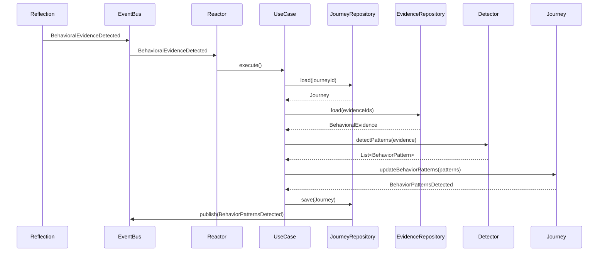
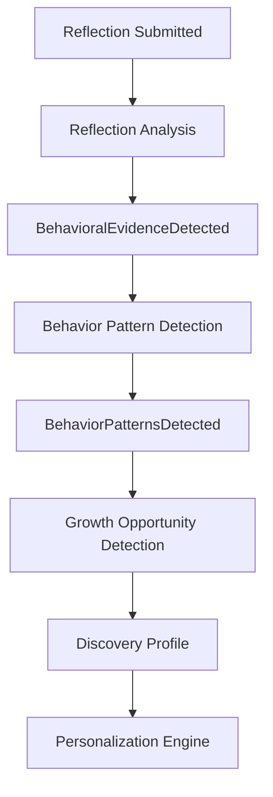
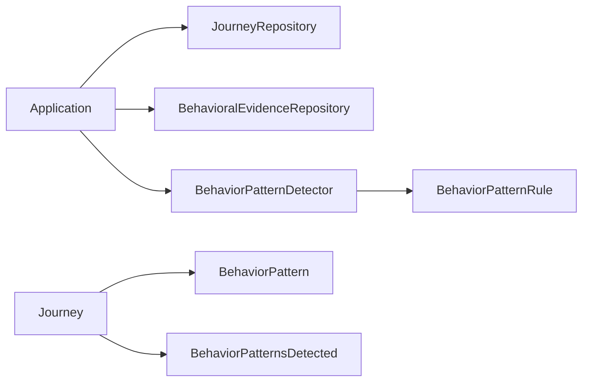
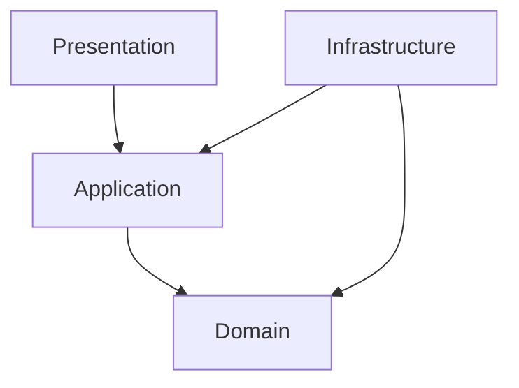
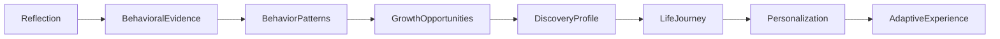

# Chapter 1 Purpose and Vision

Behavior Pattern Detection represents the next major evolution of the Everyone's Heroes domain model. It transforms individual behavioral observations into meaningful, long-term understanding that can be used to create increasingly personalized experiences.

This chapter builds upon the platform's core philosophy that the purpose of the system is not merely to collect data, but to understand each individual well enough to inspire lasting growth. 

Unlike the Reflection Analysis Pipeline, which focuses on extracting insights and behavioral evidence from a single reflection, Behavior Pattern Detection synthesizes observations across time. It is the first architectural layer that converts isolated facts into enduring knowledge.

---

# From Observation to Understanding

Behavioral Evidence represents atomic observations.

A single reflection may reveal discipline, courage, avoidance, resilience, or leadership. These observations are valuable, but they are intentionally limited in scope. They describe what was observed during a specific interaction. They do not attempt to characterize the individual as a whole.

This distinction is fundamental to the platform's evidence-first philosophy. 

Behavior Pattern Detection introduces a new level of abstraction.

Rather than asking:

> **"What behavior was observed?"**

the platform begins asking:

> **"What recurring behaviors are emerging over time?"**

Patterns represent accumulated understanding rather than isolated observations.

For example, a single instance of discipline is simply evidence.

Repeated demonstrations of discipline across many reflections, missions, and future evidence sources may reveal a **Consistency Pattern**.

Likewise, recurring observations of leadership may reveal an **Emerging Leadership Pattern**.

Patterns therefore describe long-term behavioral tendencies rather than individual moments.

---

# Knowledge Rather Than Conclusions

One of the foundational architectural principles of Everyone's Heroes is to preserve observations before generating interpretations.

The platform intentionally stores evidence and derives higher-level understanding from that evidence rather than storing opaque conclusions directly. 

Behavior Pattern Detection represents the first layer of durable knowledge within this progression.

```text
Reflection
        ↓
Behavioral Evidence
        ↓
Behavior Pattern
```

Evidence answers:

> **"What happened?"**

Patterns answer:

> **"What consistently appears to be true?"**

This distinction allows the platform to remain explainable.

Every detected pattern can be traced back to the specific Behavioral Evidence that supports it, preserving transparency while avoiding premature conclusions.

Patterns are therefore not assumptions.

They are deterministic syntheses of observable evidence accumulated over time.

---

# The Foundation of Adaptive Personalization

Behavior Pattern Detection is not an isolated feature.

It exists to enable the platform's larger vision of adaptive human growth.

Everyone's Heroes is designed to continuously improve its understanding of each individual through intentional discovery activities, behavioral evidence, and ongoing interaction.

That understanding ultimately powers the Personalization Engine, which creates experiences uniquely tailored to inspire each person. 

Behavior Patterns become one of the primary inputs into this personalization process.

Future adaptive experiences may include:

- Personalized Missions
- Adaptive Reflection Prompts
- Hero Stories
- Motivational Talks
- AI-generated Music
- Personalized Song Lyrics
- Coaching Conversations
- Narrative Guidance
- Future adaptive experiences not yet imagined

The architecture is intentionally centered on understanding rather than any individual output.

By investing in a richer behavioral model, entirely new experience types can be introduced without changing the underlying domain model.

---

# A Deliberate Separation of Responsibilities

Behavior Pattern Detection establishes a clear separation between observation and understanding.

The Reflection aggregate owns observations.

The Journey aggregate owns accumulated understanding.

Behavior Pattern Detection serves as the transformation layer between those responsibilities.

```text
Reflection
        │
        │ produces
        ▼
Behavioral Evidence
        │
        │ synthesized by
        ▼
BehaviorPatternDetector
        │
        │ updates
        ▼
Journey
```

This separation preserves aggregate boundaries while allowing knowledge to accumulate naturally over time.

Behavioral Evidence remains immutable historical fact.

Behavior Patterns represent the Journey's current understanding of itself.

This distinction is critical because observations never change, while understanding continuously evolves as additional evidence is collected.

---

# Deterministic Understanding

Behavior Pattern Detection is intentionally deterministic.

The purpose of this phase is not to introduce artificial intelligence into the domain.

Instead, it establishes a stable, explainable, and repeatable behavioral model built upon deterministic rules.

Given the same Behavioral Evidence, the detector should always produce the same Behavior Patterns.

This deterministic foundation provides several architectural benefits:

- Explainable behavior
- Repeatable results
- Comprehensive automated testing
- Vendor-independent domain logic
- Stable architectural evolution
- Confidence in future refactoring

Artificial intelligence remains an implementation detail that may later enhance personalization, coaching, storytelling, and motivational experiences.

AI does **not** determine behavioral truth.

The authoritative understanding of an individual's growth continues to originate from deterministic Behavioral Evidence and deterministic Pattern Detection. 

---

# Preparing the Next Evolution

Behavior Pattern Detection is intentionally designed as a foundational capability rather than an end goal.

Once recurring behavioral patterns can be identified, future architectural layers can derive increasingly meaningful guidance while preserving complete explainability.

The long-term progression becomes:

```text
Reflection
        ↓
Behavioral Evidence
        ↓
Behavior Patterns
        ↓
Growth Opportunities
        ↓
Discovery Profile
        ↓
Personalization Engine
        ↓
Adaptive Experiences
```

Each stage introduces a single additional level of abstraction while preserving the information produced by earlier stages.

Observations remain available.

Patterns remain traceable.

Growth opportunities remain explainable.

Adaptive experiences remain grounded in objective understanding.

This layered architecture enables the platform to continuously deepen its understanding of each individual without sacrificing transparency, testability, or architectural clarity.

Ultimately, Behavior Pattern Detection fulfills a central principle of the Everyone's Heroes vision:

> **The purpose of the platform is not simply to understand the user. The purpose is to understand the user well enough to create transformative, deeply personal experiences that inspire lasting growth.**

Behavior Pattern Detection is the first architectural layer that makes this vision possible by transforming isolated observations into enduring understanding—the foundation upon which every future adaptive experience is built. 

---
# Chapter 2 Architectural Context

Behavior Pattern Detection occupies a pivotal position within the Everyone's Heroes architecture. It is the bridge between **behavioral observation** and **personal understanding**, transforming individual pieces of Behavioral Evidence into enduring knowledge about how a person consistently behaves over time.

This layer represents the platform's transition from collecting information to developing understanding. Every architectural capability that follows—including Growth Opportunities, the Discovery Profile, and the Personalization Engine—depends upon the knowledge established during this phase. 

---

# Position Within the Adaptive Discovery & Evidence Engine

The Adaptive Discovery & Evidence Engine is designed as a progressive pipeline in which each stage adds a single level of abstraction while preserving the outputs of previous stages.

Rather than attempting to generate personalized guidance directly from raw observations, the architecture intentionally decomposes understanding into a sequence of deterministic transformations.

The complete pipeline is:

```text
Discovery Activities
        ↓
Behavioral Evidence
        ↓
Behavior Patterns
        ↓
Growth Opportunities
        ↓
Discovery Profile
        ↓
Personalization Engine
        ↓
Adaptive Experiences
```

Each stage has a distinct responsibility.

| Layer | Responsibility | Produces |
|--------|----------------|----------|
| Discovery Activities | Learn about the individual through intentional interactions | Discovery Data |
| Behavioral Evidence | Record atomic observations | BehavioralEvidence |
| **Behavior Pattern Detection** | Synthesize recurring behavioral trends | BehaviorPattern |
| Growth Opportunity Detection | Identify meaningful opportunities for growth | GrowthOpportunity |
| Discovery Profile | Maintain a holistic understanding of the individual | DiscoveryProfile |
| Personalization Engine | Transform understanding into adaptive experiences | Missions, Stories, Music, Coaching, and more |

Behavior Pattern Detection is the first architectural layer responsible for producing **knowledge** rather than merely recording **observations**.

This progression reflects the platform's evidence-first philosophy:

```text
Store
    ↓
Observe
    ↓
Understand
    ↓
Inspire
```

Instead of jumping directly from evidence to recommendations, the platform intentionally preserves every intermediate level of understanding. This layered approach ensures that future guidance remains explainable, transparent, and traceable to observable facts. 

---

# Relationship to the Reflection Analysis Pipeline

Behavior Pattern Detection is the natural continuation of the Reflection Analysis Pipeline introduced in Phase H.1.

The Reflection Analysis Pipeline concludes by generating Behavioral Evidence from submitted reflections.

```text
Reflection
        ↓
Insights
        ↓
Behavioral Evidence
```

Behavior Pattern Detection begins immediately afterward.

```text
BehavioralEvidenceDetected
        ↓
BehavioralEvidenceDetectedReactor
        ↓
DetectBehaviorPatternsUseCase
        ↓
BehaviorPatternDetector
        ↓
Journey.updateBehaviorPatterns()
        ↓
BehaviorPatternsDetected
```

Together these phases create a continuous transformation pipeline:

```text
Reflection
        ↓
Insights
        ↓
Behavioral Evidence
        ↓
Behavior Patterns
```

Each phase answers a different question.

The Reflection Analysis Pipeline asks:

> **What behaviors were observed?**

Behavior Pattern Detection asks:

> **What recurring behavioral tendencies are emerging?**

Maintaining this separation allows each phase to evolve independently while preserving clear architectural responsibilities.

---

# Relationship to the Journey Aggregate

Behavior Patterns represent the Journey's accumulated understanding of itself.

Unlike Behavioral Evidence, which belongs to a specific Reflection, Behavior Patterns describe characteristics that emerge across many observations over time.

For this reason, Behavior Patterns belong to the **Journey aggregate**.

```text
Journey
├── Vision
├── Chapters
├── Quests
└── BehaviorPatterns
```

The Journey aggregate is responsible for:

- Maintaining its current collection of detected Behavior Patterns.
- Determining whether newly detected patterns represent meaningful change.
- Preserving aggregate consistency.
- Publishing `BehaviorPatternsDetected` when its understanding changes.

The detector itself remains intentionally unaware of the Journey.

Instead, it performs a pure transformation:

```text
Behavioral Evidence
        ↓
BehaviorPatternDetector
        ↓
List<BehaviorPattern>
```

The Journey then evaluates those detected patterns and decides whether its internal understanding should change.

This separation preserves the aggregate as the consistency boundary while keeping the detector deterministic, reusable, and independently testable.

---

# Relationship to the Discovery Context

Although Behavior Patterns contribute to personalization, they are intentionally **not** part of the Discovery bounded context.

The two contexts answer fundamentally different questions.

Discovery asks:

> **What inspires this person?**

Life Journey asks:

> **How is this person growing?**

Discovery owns concepts such as:

- Discovery Profile
- Influences
- Narrative Themes
- Discovery History

Life Journey owns:

- Reflections
- Behavioral Evidence
- Behavior Patterns
- Growth Opportunities

Behavior Pattern Detection therefore remains entirely within the **Life Journey** bounded context.

The Discovery context will later consume this understanding through well-defined integration points rather than sharing ownership of behavioral concepts.

This separation preserves bounded context autonomy while enabling increasingly sophisticated personalization. 

---

# Relationship to Future Growth Opportunity Detection

Behavior Pattern Detection intentionally stops at understanding recurring behavior.

It does **not** determine what action should be taken.

That responsibility belongs to the next architectural layer.

```text
Behavior Patterns
        ↓
Growth Opportunity Detection
        ↓
Growth Opportunities
```

Examples include:

```text
Consistency Pattern
        ↓
Increase mission difficulty

Avoidance Pattern
        ↓
Boundary-setting opportunity

Leadership Pattern
        ↓
Mentorship opportunity
```

Separating pattern detection from opportunity detection ensures that behavioral understanding remains independent from recommendations.

This preserves explainability while allowing increasingly sophisticated opportunity detection strategies to evolve without modifying the underlying behavioral model.

---

# Relationship to the Discovery Profile

The Discovery Profile represents the platform's comprehensive understanding of an individual.

Behavior Patterns become one of its primary sources of knowledge.

```text
Discovery Profile
├── Discovery Activities
├── Influences
├── Narrative Themes
├── Behavioral Evidence
├── Behavior Patterns
├── Growth Opportunities
└── Motivational Preferences
```

The Discovery Profile does **not** own Behavior Patterns.

Instead, it references and synthesizes knowledge produced by the Life Journey context.

This distinction preserves bounded context ownership while allowing the Discovery Profile to become the unified representation of the individual used throughout the platform for personalization. 

---

# Relationship to the Personalization Engine

Behavior Pattern Detection is not an end-user feature.

Its purpose is to improve the quality of every future adaptive experience.

The Personalization Engine consumes multiple sources of structured understanding.

```text
Discovery Profile
        │
Behavior Patterns
        │
Growth Opportunities
        │
Narrative Themes
        │
Influences
        ▼
Personalization Engine
        ▼
Adaptive Experiences
```

Those adaptive experiences may include:

- Adaptive Missions
- Personalized Reflection Prompts
- Hero Stories
- Motivational Talks
- AI-generated Music
- Coaching Conversations
- Future adaptive experiences that do not yet exist

Behavior Pattern Detection therefore provides one of the foundational inputs that enables the Personalization Engine to answer the platform's central question:

> **"What experience will best inspire this person to become who they want to become?"**

Rather than generating recommendations directly, Behavior Pattern Detection strengthens the platform's understanding of the individual, allowing every future adaptive experience to become increasingly relevant, explainable, and personally meaningful.

The architecture intentionally separates **understanding** from **presentation**, ensuring that new forms of personalized inspiration can be introduced without changing the underlying domain model. 
---

# Chapter 3 Domain-Driven Design Analysis

Behavior Pattern Detection introduces one of the most significant domain modeling decisions within the Everyone's Heroes platform. Rather than simply adding a new object to the model, this phase establishes clear aggregate boundaries, ownership responsibilities, and lifecycle rules that preserve the integrity of the domain.

This chapter explains the rationale behind those decisions and demonstrates how they align with Domain-Driven Design (DDD) principles.

---

# Design Goals

The architectural design of Behavior Pattern Detection is guided by the following goals:

- Preserve aggregate consistency boundaries.
- Keep responsibilities cohesive and well-defined.
- Prevent duplicated behavioral knowledge.
- Maintain deterministic and explainable behavior.
- Allow future architectural evolution without breaking existing aggregates.
- Support long-term personalization through accumulated understanding.

Rather than optimizing for short-term implementation convenience, the model is designed to support the platform's long-term vision of adaptive human growth. 

---

# Aggregate Ownership

Behavior Pattern Detection spans multiple aggregates, each with a distinct responsibility.

```text
Reflection Aggregate
        │
        │ owns
        ▼
Behavioral Evidence
        │
        │ analyzed by
        ▼
BehaviorPatternDetector
        │
        │ updates
        ▼
Journey Aggregate
        │
        │ owns
        ▼
Behavior Patterns
```

Each aggregate owns only the information necessary to fulfill its responsibilities.

| Aggregate | Owns | Purpose |
|-----------|------|---------|
| Reflection | Reflection Responses, Insights, Behavioral Evidence | Capture and analyze individual experiences |
| Journey | Chapters, Quests, Missions, Behavior Patterns | Maintain long-term understanding of personal growth |
| Discovery *(future)* | Discovery Profile, Influences, Narrative Themes | Understand what inspires the individual |

This separation prevents multiple aggregates from maintaining competing representations of the same behavioral knowledge.

---

# Why Journey Owns Behavior Patterns

Behavior Patterns represent the Journey's accumulated understanding of an individual's growth.

Unlike Behavioral Evidence, which is tied to a single interaction, patterns emerge only after evidence has accumulated across multiple reflections, missions, and future evidence sources.

For this reason, they belong to the aggregate responsible for long-term growth.

```text
Journey
├── Chapters
├── Quests
├── Vision
└── BehaviorPatterns
```

The Journey is responsible for answering questions such as:

- How has this individual changed over time?
- What recurring strengths have emerged?
- What recurring obstacles continue to appear?
- Has the person's behavioral understanding changed?

These questions span many individual reflections.

No single Reflection possesses sufficient information to answer them.

Because the Journey already represents a person's ongoing growth within a particular life domain, it naturally becomes the consistency boundary for accumulated behavioral understanding.

---

# Why Patterns Do Not Belong to Reflection

Reflections capture moments.

Patterns describe journeys.

A Reflection represents one completed experience.

Its responsibilities include:

- Capturing responses
- Producing Insights
- Producing Behavioral Evidence
- Preserving historical observations

Once submitted, a Reflection becomes immutable.

Behavior Patterns, however, continuously evolve as additional evidence becomes available.

If patterns were owned by Reflection, several architectural problems would emerge:

- Multiple reflections would contain competing copies of the same pattern.
- Updating a pattern would require modifying historical aggregates.
- Aggregate consistency would become impossible to maintain.
- Pattern history would become fragmented across many Reflections.

This violates one of the central principles of DDD:

> An aggregate should own only the state that it is responsible for keeping consistent.

Reflection owns historical observations.

Journey owns evolving understanding.

---

# Why Reflection Owns Behavioral Evidence

Behavioral Evidence is produced directly from a Reflection.

It is the deterministic result of analyzing the user's responses during a single reflective experience.

```text
Reflection
        │
        ├── Responses
        ├── Insights
        └── Behavioral Evidence
```

Behavioral Evidence answers questions such as:

- Was courage demonstrated?
- Was avoidance observed?
- Did the user follow through?
- Was leadership exhibited?

These observations are facts about one specific experience.

They never change after the Reflection has been analyzed.

Because Behavioral Evidence is derived entirely from Reflection data, it naturally belongs to the Reflection aggregate.

Keeping evidence within Reflection preserves several important properties:

- Historical traceability.
- Immutable audit history.
- Explainable pattern detection.
- Reproducible analysis.
- Independence from future behavioral understanding.

Behavior Patterns are always derived from evidence.

Evidence is never derived from patterns.

This one-way dependency preserves the platform's evidence-first philosophy. 

---

# Why BehaviorPattern Is a Value Object

One of the most important modeling decisions in this phase is representing `BehaviorPattern` as a **Value Object** rather than an Entity.

A Behavior Pattern has no independent identity.

Its meaning is determined entirely by its values.

For example:

```text
BehaviorPattern
├── Type
├── Strength
├── FirstObservedAt
├── LastObservedAt
└── SupportingEvidenceIds
```

Two Behavior Patterns with identical values represent the same concept.

There is no reason to distinguish one from another by identity.

This makes BehaviorPattern an ideal Value Object.

It possesses the defining characteristics of a Value Object:

- Immutable
- Equality based entirely on state
- No independent lifecycle
- No globally meaningful identity
- Replaceable rather than mutable

When new evidence is analyzed, the Journey simply replaces its existing collection of patterns with a newly computed collection.

There is no need to update individual BehaviorPattern instances in place.

This approach greatly simplifies reasoning about behavioral understanding while eliminating unnecessary complexity associated with entity identity and lifecycle management.

---

# Why There Is No BehaviorPatternRepository

Repositories exist to persist aggregate roots.

Behavior Patterns are not aggregate roots.

They are components of the Journey aggregate.

Creating a dedicated `BehaviorPatternRepository` would introduce several problems:

- Duplicate consistency boundaries.
- Independent persistence of aggregate internals.
- Additional synchronization concerns.
- Unnecessary transactional complexity.

Instead, Behavior Patterns are persisted as part of the Journey.

```text
JourneyRepository
        │
        ▼
Journey
├── Chapters
├── Quests
└── BehaviorPatterns
```

This keeps all long-term behavioral understanding within a single aggregate boundary.

The repository remains responsible only for loading and saving the aggregate as a whole.

---

# Aggregate Consistency

The Journey aggregate becomes the authoritative source for behavioral understanding.

When new Behavioral Evidence is detected, the application layer orchestrates the following process:

```text
Load Journey
        ↓
Load Behavioral Evidence
        ↓
Detect Behavior Patterns
        ↓
Journey.updateBehaviorPatterns()
        ↓
Persist Journey
        ↓
Publish BehaviorPatternsDetected
```

The detector does **not** modify the Journey.

It simply returns the patterns it believes should exist.

The Journey then compares those patterns against its current understanding and determines whether meaningful change has occurred.

This preserves aggregate autonomy while allowing domain services to remain pure and side-effect free.

---

# Preparing for Future Evolution

The current ownership model intentionally anticipates future architectural growth.

Future layers consume Behavior Patterns without assuming ownership.

```text
Reflection
        │
        ▼
Behavioral Evidence
        │
        ▼
Journey
        │
        ▼
Behavior Patterns
        │
        ├──────────────┐
        │              │
        ▼              ▼
Growth Opportunities  Discovery Profile
        │              │
        └──────┬───────┘
               ▼
      Personalization Engine
```

This hierarchy establishes a clear progression of responsibility:

- **Reflection** records experiences.
- **Journey** develops understanding.
- **Discovery** synthesizes understanding.
- **Personalization** creates experiences.

Each layer depends only on the outputs of the layer before it, allowing the architecture to evolve while preserving clear ownership boundaries.

---

# Summary of Design Decisions

| Decision | Rationale |
|----------|-----------|
| Reflection owns Behavioral Evidence | Evidence is produced directly from a single reflection and represents immutable historical observations. |
| Journey owns Behavior Patterns | Patterns describe long-term understanding accumulated across many reflections. |
| BehaviorPattern is a Value Object | Patterns have no independent identity and are defined entirely by their values. |
| No BehaviorPatternRepository | Patterns are part of the Journey aggregate and should be persisted through JourneyRepository. |
| BehaviorPatternDetector is a Domain Service | Pattern detection is a deterministic transformation, not aggregate behavior. |
| Journey decides pattern changes | Only the aggregate can determine whether its internal understanding has meaningfully changed. |

These design decisions establish a domain model that is cohesive, deterministic, and aligned with the long-term architectural vision of Everyone's Heroes. By clearly separating **observations**, **understanding**, and **personalization**, the model remains extensible while preserving the consistency boundaries that are fundamental to effective Domain-Driven Design. 
---

# Chapter 4 Domain Model

The Behavior Pattern Detection domain model extends the Life Journey bounded context by introducing a deterministic representation of long-term behavioral understanding.

The model intentionally separates:

- **Behavioral observations** (Behavioral Evidence)
- **Behavioral understanding** (Behavior Patterns)
- **Behavioral reasoning** (Pattern Rules)
- **Behavioral synthesis** (Behavior Pattern Detector)

Each concept has a single responsibility, allowing the domain to evolve while preserving explainability, deterministic behavior, and aggregate consistency.

---

# Domain Model Overview

The high-level domain model is shown below.

```text
                    +---------------------------+
                    |        Journey            |
                    +---------------------------+
                    | behaviorPatterns          |
                    +---------------------------+
                               │
                               │ owns
                               ▼
                    +---------------------------+
                    |     BehaviorPattern       | <<Value Object>>
                    +---------------------------+
                    | type                      |
                    | confidence               |
                    | strength                 |
                    | firstObservedAt          |
                    | lastObservedAt           |
                    | supportingEvidenceIds    |
                    +---------------------------+
                               │
                               │ references
                               ▼
                    +---------------------------+
                    |   BehaviorPatternType     |
                    +---------------------------+

Reflection
      │
      ▼
BehavioralEvidence
      │
      ▼
BehaviorPatternDetector
      │
      ▼
List<BehaviorPattern>
```

The model deliberately keeps observations separate from behavioral understanding.

Behavioral Evidence records facts.

Behavior Patterns describe recurring tendencies inferred from those facts.

---

# Journey Aggregate

The Journey aggregate is the authoritative owner of long-term behavioral understanding.

```text
Journey
├── JourneyId
├── Vision
├── Chapters
├── Quests
└── BehaviorPatterns
```

Responsibilities include:

- Maintaining the current behavioral understanding.
- Replacing obsolete patterns.
- Detecting meaningful behavioral change.
- Publishing domain events.
- Preserving aggregate consistency.

Behavior Patterns are internal state owned entirely by the Journey.

They are never modified independently.

---

# BehaviorPattern

BehaviorPattern represents the platform's current understanding of a recurring behavioral tendency.

It is intentionally modeled as a **Value Object**.

```text
<<Value Object>>

BehaviorPattern
──────────────────────────────────────────
+ type : BehaviorPatternType
+ confidence : double
+ strength : PatternStrength
+ firstObservedAt : DateTime
+ lastObservedAt : DateTime
+ supportingEvidenceIds : Set<EvidenceId>
```

## Responsibilities

A BehaviorPattern is responsible for describing:

- What recurring behavior has emerged.
- How confidently it has been detected.
- How strong the pattern currently appears.
- When it first appeared.
- When it was most recently observed.
- Which evidence supports the conclusion.

A BehaviorPattern is **not** responsible for:

- Detecting itself.
- Updating itself.
- Persisting itself.
- Owning evidence.

Its sole purpose is to represent behavioral understanding.

---

# BehaviorPatternType

BehaviorPatternType defines the canonical categories of recurring behaviors recognized by the platform.

```text
enum BehaviorPatternType

Consistency
Resilience
Leadership
GrowthMindset
Avoidance
Compassion
Integrity
Discipline
Initiative
Accountability
Curiosity
Service
Communication
Adaptability
Future Types...
```

The enumeration is intentionally open for expansion.

Future platform versions may introduce additional behavioral dimensions without changing the surrounding architecture.

The detector remains responsible for determining when sufficient evidence exists to instantiate a particular pattern.

---

# PatternStrength

Not all detected patterns are equally significant.

PatternStrength provides a qualitative measure of behavioral maturity.

```text
enum PatternStrength

Emerging
Developing
Established
Exceptional
```

This value enables future systems to distinguish between:

- Recently emerging behaviors.
- Consistently demonstrated behaviors.
- Highly established behavioral characteristics.

Pattern strength is derived deterministically from accumulated evidence.

---

# Pattern Rules

Pattern detection is driven by explicit domain rules.

A rule defines the criteria required to recognize a particular behavioral pattern.

Rather than embedding detection logic directly inside the detector, each pattern encapsulates its own evaluation strategy.

```text
<<Interface>>

BehaviorPatternRule
──────────────────────────────────────────
+ type : BehaviorPatternType
+ evaluate(
      evidence : List<BehavioralEvidence>
  ) : BehaviorPattern?
```

Each implementation determines whether sufficient evidence exists to produce a BehaviorPattern.

Example implementations include:

```text
ConsistencyPatternRule

LeadershipPatternRule

ResiliencePatternRule

AvoidancePatternRule

GrowthMindsetPatternRule
```

This architecture follows the **Open/Closed Principle**.

New patterns can be introduced by adding new rule implementations without modifying existing detection logic.

---

# BehaviorPatternDetector

BehaviorPatternDetector is a domain service responsible for orchestrating pattern detection.

It does **not** contain the behavioral rules themselves.

Instead, it coordinates rule execution.

```text
<<Domain Service>>

BehaviorPatternDetector
──────────────────────────────────────────
+ detectPatterns(
      evidence : List<BehavioralEvidence>
  ) : List<BehaviorPattern>
```

Internally, the detector evaluates every registered rule.

```text
BehaviorPatternDetector
        │
        ├────────► ConsistencyPatternRule
        │
        ├────────► LeadershipPatternRule
        │
        ├────────► ResiliencePatternRule
        │
        ├────────► AvoidancePatternRule
        │
        └────────► ...
```

Each rule independently determines whether a pattern exists.

The detector simply aggregates the results.

This design keeps the detector:

- Deterministic
- Stateless
- Easily testable
- Extensible

---

# Detector Interfaces

To preserve loose coupling, the application layer depends upon abstractions rather than concrete implementations.

```text
<<Interface>>

BehaviorPatternDetector
──────────────────────────────────────────
+ detectPatterns(
      evidence : List<BehavioralEvidence>
  ) : List<BehaviorPattern>
```

Possible implementations include:

```text
RuleBasedBehaviorPatternDetector

CompositeBehaviorPatternDetector

ExperimentalBehaviorPatternDetector
```

The initial implementation for Phase H.2 will use a deterministic rule-based detector.

Future implementations may introduce more sophisticated detection strategies while preserving the same public interface.

---

# Supporting Relationships

The complete object relationships are illustrated below.

```text
                    Journey
                       │
                       │ owns
                       ▼
            BehaviorPattern (VO)
                       │
             type
                       ▼
          BehaviorPatternType

Reflection
       │
       ▼
BehavioralEvidence
       │
       ▼
BehaviorPatternDetector
       │
       ▼
BehaviorPatternRule*
       │
       ▼
BehaviorPattern
```

This model establishes a one-way flow of information.

Observations become evidence.

Evidence is evaluated by rules.

Rules produce patterns.

Patterns become part of the Journey's accumulated understanding.

No component depends upon future layers of the architecture.

---

# Design Principles

Several architectural principles shaped this model.

## Immutable Knowledge

Behavior Patterns are immutable Value Objects.

Behavioral understanding changes by replacing patterns rather than mutating them.

---

## Deterministic Behavior

Given the same Behavioral Evidence, the detector must always produce the same Behavior Patterns.

This guarantees reproducibility, explainability, and reliable automated testing.

---

## Explainability

Every BehaviorPattern can be traced directly to the Behavioral Evidence that produced it.

No behavioral understanding exists without supporting evidence.

---

## Open for Extension

Adding a new behavioral pattern requires:

1. Creating a new `BehaviorPatternType`.
2. Implementing a new `BehaviorPatternRule`.
3. Registering the rule with the detector.

No existing rules or aggregates require modification.

---

## Aggregate Integrity

The Journey remains the sole owner of behavioral understanding.

Neither detectors nor rules modify aggregate state directly.

Instead, they produce proposed patterns that the Journey evaluates before updating its internal state.

---

# Summary

The Behavior Pattern Detection domain model introduces a clear separation between **behavioral observations**, **behavioral reasoning**, and **behavioral understanding**.

| Component | Responsibility |
|-----------|----------------|
| **BehavioralEvidence** | Immutable observations produced from a Reflection |
| **BehaviorPatternRule** | Determines whether sufficient evidence exists for a specific pattern |
| **BehaviorPatternDetector** | Coordinates rule execution and synthesizes detected patterns |
| **BehaviorPattern** | Immutable Value Object representing recurring behavior |
| **BehaviorPatternType** | Canonical classification of behavioral tendencies |
| **Journey** | Owns and maintains accumulated behavioral understanding |

This model creates a deterministic, extensible, and highly cohesive foundation that supports future Growth Opportunity Detection, Discovery Profile synthesis, and the Personalization Engine while preserving the architectural principles established throughout the Everyone's Heroes platform. 

---

---

# Chapter 5 Event Architecture

Behavior Pattern Detection is implemented as an event-driven workflow that extends the existing event architecture established by the Reflection Analysis Pipeline. Rather than introducing new orchestration mechanisms, this phase consumes domain events already produced by the platform, performs deterministic behavioral analysis, and publishes new events describing changes in the Journey's behavioral understanding.

The event architecture intentionally separates **event producers**, **application orchestration**, **domain logic**, and **aggregate state changes**, ensuring each layer remains independently testable and loosely coupled.

---

# Event-Driven Architecture Overview

Behavior Pattern Detection begins only after a Reflection has completed analysis and Behavioral Evidence has been persisted.

The overall event flow is illustrated below.

```text
Reflection Submitted
        │
        ▼
Reflection Analysis Pipeline
        │
        ▼
BehavioralEvidenceDetected
        │
        ▼
BehavioralEvidenceDetectedReactor
        │
        ▼
DetectBehaviorPatternsUseCase
        │
        ▼
BehaviorPatternDetector
        │
        ▼
Journey.updateBehaviorPatterns()
        │
        ▼
BehaviorPatternsDetected
```

The detector is never invoked directly by user interface code.

Instead, behavioral understanding emerges naturally as a consequence of completed reflection analysis.

This architecture ensures that every behavioral pattern is traceable to observable evidence while preserving asynchronous domain boundaries.

---

# Complete Event Sequence

The complete sequence for detecting behavior patterns is shown below.

```text
User
 │
 │ Submit Reflection
 ▼
Reflection Aggregate
 │
 │ analyze()
 ▼
Reflection Analysis Pipeline
 │
 │ produces
 ▼
BehavioralEvidence
 │
 │ publishes
 ▼
BehavioralEvidenceDetected
 │
 ▼
BehavioralEvidenceDetectedReactor
 │
 │ invokes
 ▼
DetectBehaviorPatternsUseCase
 │
 │ loads
 ├──────────────► JourneyRepository
 │
 │ loads
 ├──────────────► BehavioralEvidenceRepository
 │
 │ detects
 ▼
BehaviorPatternDetector
 │
 │ returns
 ▼
List<BehaviorPattern>
 │
 │ updates
 ▼
Journey
 │
 │ publishes
 ▼
BehaviorPatternsDetected
 │
 ▼
Future Subscribers
```

Each participant has a single responsibility:

| Component | Responsibility |
|-----------|----------------|
| Reflection | Produces Behavioral Evidence |
| Reactor | Responds to domain events |
| Use Case | Coordinates the workflow |
| Detector | Produces behavior patterns |
| Journey | Decides whether understanding has changed |
| Event Bus | Publishes resulting domain events |

---

# Event Ownership

Every domain event has a single authoritative owner.

Events are always published by the aggregate that owns the state being changed.

## BehavioralEvidenceDetected

**Owner**

Reflection Aggregate

**Meaning**

New Behavioral Evidence has been produced.

```text
Reflection
        │
        ▼
BehavioralEvidenceDetected
```

Only the Reflection aggregate may publish this event because it owns Behavioral Evidence.

---

## BehaviorPatternsDetected

**Owner**

Journey Aggregate

**Meaning**

The Journey's behavioral understanding has changed.

```text
Journey
        │
        ▼
BehaviorPatternsDetected
```

Although the detector identifies candidate patterns, only the Journey determines whether its understanding has changed sufficiently to publish the event.

This preserves aggregate autonomy.

---

# Event Ownership Rules

The architecture follows several ownership principles.

## Aggregates publish events

Application services never publish domain events directly.

Instead:

```text
Aggregate changes state
        │
        ▼
Aggregate publishes event
```

This guarantees that every event corresponds to an actual domain state transition.

---

## Reactors never own data

Reactors coordinate work.

They never own behavioral understanding.

```text
Event
      │
      ▼
Reactor
      │
      ▼
Use Case
```

A reactor's responsibility is limited to initiating application workflows.

---

## Domain services never publish events

BehaviorPatternDetector returns domain objects.

It does not publish events.

```text
BehaviorPatternDetector
        │
        ▼
List<BehaviorPattern>
```

Publishing remains the responsibility of the aggregate whose state has changed.

---

# Event Payload Design

Domain events should contain sufficient information for downstream consumers while avoiding duplication of aggregate state.

## BehavioralEvidenceDetected

```text
BehavioralEvidenceDetected
────────────────────────────────────
reflectionId
journeyId
evidenceIds
occurredAt
```

The payload intentionally contains identifiers rather than complete objects.

Subscribers load the current aggregate state from repositories when additional information is required.

This approach avoids stale data while reducing event size.

---

## BehaviorPatternsDetected

```text
BehaviorPatternsDetected
────────────────────────────────────
journeyId
patternTypes
changedPatterns
occurredAt
```

The event communicates:

- Which Journey changed.
- Which patterns were affected.
- When the change occurred.

Future subscribers can retrieve the complete Journey aggregate if additional context is required.

---

# Why Events Carry Identifiers

The platform intentionally avoids placing entire aggregates inside domain events.

Instead:

```text
Good

JourneyId
PatternIds
EvidenceIds
OccurredAt
```

rather than

```text
Avoid

Journey
Reflection
BehaviorPattern
BehavioralEvidence
```

This design offers several benefits:

- Smaller event payloads.
- Reduced serialization overhead.
- Easier versioning.
- Fewer stale object problems.
- Better aggregate encapsulation.

Events communicate **what changed**, not **everything that exists**.

---

# Event Lifecycle

Every domain event progresses through a predictable lifecycle.

```text
Aggregate State Changes
        │
        ▼
Domain Event Created
        │
        ▼
Published on Event Bus
        │
        ▼
Reactor Receives Event
        │
        ▼
Application Workflow Executes
        │
        ▼
Aggregate Updated
        │
        ▼
New Domain Event Published
```

Each event is immutable once created.

No subscriber modifies an existing event.

Instead, additional work produces entirely new domain events.

This event chaining naturally models the progression of understanding throughout the system.

---

# End-to-End Lifecycle

Behavior Pattern Detection forms one stage within a larger event pipeline.

```text
ReflectionSubmitted
        │
        ▼
ReflectionCompleted
        │
        ▼
BehavioralEvidenceDetected
        │
        ▼
BehaviorPatternsDetected
        │
        ▼
GrowthOpportunitiesDetected
        │
        ▼
DiscoveryProfileUpdated
        │
        ▼
PersonalizationUpdated
```

Each event advances the platform one level of abstraction.

Earlier events remain immutable historical facts.

Later events represent increasingly sophisticated understanding.

---

# Event Ordering

Behavior Pattern Detection assumes deterministic event ordering.

The required ordering is:

```text
ReflectionCompleted
        │
        ▼
BehavioralEvidenceDetected
        │
        ▼
BehaviorPatternsDetected
```

BehaviorPatternsDetected must never occur before BehavioralEvidenceDetected.

Likewise, future Growth Opportunity Detection must never execute until behavioral patterns have been finalized.

This ordered progression preserves causal consistency throughout the domain.

---

# Idempotency

All reactors should be idempotent.

If the same event is processed multiple times:

```text
BehavioralEvidenceDetected
        │
        ▼
Detector
        │
        ▼
Same BehaviorPatterns
```

the resulting Journey state should remain unchanged.

Deterministic pattern detection and aggregate comparison ensure duplicate event processing does not create duplicate patterns or inconsistent behavior.

This property simplifies recovery after failures and supports future distributed processing.

---

# Future Event Subscribers

BehaviorPatternsDetected is expected to become one of the platform's central integration events.

Potential subscribers include:

```text
BehaviorPatternsDetected
        │
        ├── Growth Opportunity Detector
        ├── Discovery Profile Builder
        ├── Analytics
        ├── Achievement Engine
        ├── Personalization Engine
        └── Future AI Services
```

None of these systems require knowledge of how patterns were detected.

They depend only upon the published domain event.

This loose coupling allows the platform to expand without modifying existing behavioral detection logic.

---

# Architectural Benefits

The event architecture provides several important benefits.

## Loose Coupling

Each phase communicates exclusively through domain events.

No component requires direct knowledge of downstream processing.

---

## Deterministic Processing

Every event produces the same result when given the same inputs.

This guarantees reproducibility and simplifies automated testing.

---

## Clear Ownership

Every event originates from exactly one aggregate.

This preserves consistency boundaries while preventing competing sources of truth.

---

## Extensibility

Future workflows can subscribe to existing events without modifying current producers.

New capabilities become consumers rather than invasive changes to established logic.

---

## Explainability

Every behavioral pattern can be traced back through the event chain:

```text
BehaviorPatternsDetected
        ▲
BehavioralEvidenceDetected
        ▲
ReflectionCompleted
        ▲
ReflectionSubmitted
```

This complete audit trail preserves one of the platform's core architectural principles:

> Every conclusion must be explainable through observable evidence.

---

# Summary

Behavior Pattern Detection extends the existing event-driven architecture by introducing a deterministic workflow that transforms Behavioral Evidence into long-term behavioral understanding.

| Event | Published By | Purpose |
|--------|--------------|---------|
| **BehavioralEvidenceDetected** | Reflection Aggregate | Announces newly identified behavioral evidence |
| **BehaviorPatternsDetected** | Journey Aggregate | Announces updated behavioral understanding |

The application layer orchestrates the workflow, the detector performs deterministic analysis, and the Journey remains the authoritative owner of behavioral understanding. By preserving strict event ownership, immutable event payloads, and clear sequencing, the architecture provides a scalable foundation for future Growth Opportunity Detection, Discovery Profile synthesis, and the Personalization Engine while maintaining the explainability and consistency that define the Everyone's Heroes platform. 

---

# Chapter 6 Application Layer

The Application Layer orchestrates the Behavior Pattern Detection workflow without containing business rules or aggregate behavior. Its responsibility is to coordinate repositories, domain services, aggregates, and event publication while preserving clear transactional boundaries.

This layer follows the architectural principles established throughout the Everyone's Heroes platform:

- Application services orchestrate.
- Domain services perform business calculations.
- Aggregates enforce invariants.
- Repositories provide persistence.
- Events coordinate asynchronous workflows.

By maintaining these responsibilities, the application layer remains thin, deterministic, and independent of behavioral logic. 

---

# Application Workflow

Behavior Pattern Detection is initiated by a domain event rather than a direct user interaction.

The complete workflow is shown below.

```text
BehavioralEvidenceDetected
        │
        ▼
BehavioralEvidenceDetectedReactor
        │
        ▼
DetectBehaviorPatternsUseCase
        │
        ├── Load Journey
        ├── Load Behavioral Evidence
        ├── Detect Patterns
        ├── Update Journey
        ├── Save Journey
        └── Publish Events
```

The application layer performs orchestration only.

All behavioral reasoning remains inside the domain model.

---

# DetectBehaviorPatternsUseCase

The central application service is `DetectBehaviorPatternsUseCase`.

Its responsibility is to coordinate the complete pattern detection workflow.

```text
<<Application Service>>

DetectBehaviorPatternsUseCase
────────────────────────────────────────────
+ execute(
    journeyId : JourneyId,
    evidenceIds : List<EvidenceId>
  ) : void
```

The use case performs the following steps:

1. Load the Journey aggregate.
2. Load the Behavioral Evidence referenced by the event.
3. Invoke the BehaviorPatternDetector.
4. Ask the Journey to update its behavioral understanding.
5. Persist the Journey if changes occurred.
6. Publish resulting domain events.

At no point does the use case determine behavioral truth.

Instead, it coordinates collaboration between domain components.

---

# Use Case Sequence

The internal workflow is intentionally straightforward.

```text
execute()

        │
        ▼
Load Journey
        │
        ▼
Load Behavioral Evidence
        │
        ▼
BehaviorPatternDetector.detectPatterns()
        │
        ▼
Journey.updateBehaviorPatterns()
        │
        ▼
JourneyRepository.save()
        │
        ▼
Publish Domain Events
```

Each step has a clearly defined responsibility.

This separation allows every component to be tested independently.

---

# BehavioralEvidenceDetectedReactor

The application workflow is initiated by the `BehavioralEvidenceDetectedReactor`.

```text
<<Reactor>>

BehavioralEvidenceDetectedReactor
────────────────────────────────────────────
+ handle(
    event : BehavioralEvidenceDetected
  )
```

The reactor listens for newly produced Behavioral Evidence and initiates pattern detection.

Its responsibilities are intentionally limited.

It should:

- Receive the event.
- Extract identifiers.
- Invoke the application use case.

It should **not**:

- Load repositories.
- Execute business logic.
- Detect patterns.
- Modify aggregates.

The reactor remains an infrastructure adapter between the event bus and the application layer.

---

# Reactor Sequence

```text
BehavioralEvidenceDetected
        │
        ▼
BehavioralEvidenceDetectedReactor
        │
        ▼
DetectBehaviorPatternsUseCase.execute()
```

The reactor contains no branching business logic.

It simply forwards the event into the application layer.

---

# Repository Interactions

The application layer coordinates two repositories.

```text
DetectBehaviorPatternsUseCase
        │
        ├──────────────► JourneyRepository
        │
        └──────────────► BehavioralEvidenceRepository
```

Each repository has a distinct responsibility.

## JourneyRepository

Responsible for:

- Loading Journey aggregates.
- Persisting Journey aggregates.
- Preserving aggregate consistency.

```text
JourneyRepository

+ getById()
+ save()
```

The repository never performs behavioral analysis.

---

## BehavioralEvidenceRepository

Responsible for retrieving historical evidence.

```text
BehavioralEvidenceRepository

+ findByIds()

or

+ findByJourney()

or

+ findSince()
```

The detector receives Behavioral Evidence from this repository.

The repository itself performs no behavioral reasoning.

---

# Repository Collaboration

The complete repository interaction is shown below.

```text
Use Case
   │
   ├────────► JourneyRepository
   │              │
   │              ▼
   │          Journey
   │
   ├────────► BehavioralEvidenceRepository
   │              │
   │              ▼
   │      BehavioralEvidence
   │
   ▼
BehaviorPatternDetector
```

The use case becomes the sole coordinator.

Repositories never communicate directly with one another.

---

# Detector Interaction

The application layer delegates behavioral analysis entirely to the detector.

```text
BehaviorPatternDetector

detectPatterns(
    evidence
)
```

The detector returns:

```text
List<BehaviorPattern>
```

The application layer never inspects the detector's internal reasoning.

Instead, it forwards the proposed patterns to the Journey.

```text
Journey.updateBehaviorPatterns(
    patterns
)
```

Only the aggregate decides whether its understanding has changed.

---

# Aggregate Update

The update process intentionally separates calculation from state mutation.

```text
BehaviorPatternDetector
        │
        ▼
List<BehaviorPattern>
        │
        ▼
Journey.updateBehaviorPatterns()
        │
        ▼
BehaviorPatternsDetected?
```

The detector proposes.

The Journey decides.

This preserves aggregate autonomy and keeps behavioral calculations independent of persistence concerns.

---

# Transaction Boundaries

Behavior Pattern Detection executes within a single application transaction.

```text
BEGIN TRANSACTION

Load Journey

Load Behavioral Evidence

Detect Patterns

Update Journey

Persist Journey

Publish Domain Events

COMMIT
```

All modifications to the Journey occur atomically.

Either:

- the Journey is successfully updated and events are published,

or

- no changes are persisted.

This guarantees aggregate consistency.

---

# Transaction Scope

Only aggregate modifications belong inside the transaction.

```text
Within Transaction

✓ Load Aggregate

✓ Load Evidence

✓ Detect Patterns

✓ Update Aggregate

✓ Save Aggregate

✓ Publish Events
```

The following activities remain outside the transaction:

- User interface updates.
- Analytics.
- Notifications.
- Personalization.
- AI services.

Those systems subscribe to published events independently.

---

# Event Publication

The application layer does not construct domain events manually.

Instead:

```text
Journey.updateBehaviorPatterns()
        │
        ▼
Journey raises
BehaviorPatternsDetected
        │
        ▼
Repository saves aggregate
        │
        ▼
Event Bus publishes events
```

This preserves the invariant that only aggregates publish events representing changes to their own state.

---

# Error Handling

Behavior Pattern Detection is deterministic.

Failures are therefore limited primarily to infrastructure concerns.

Examples include:

- Repository failures.
- Transaction failures.
- Persistence failures.
- Event publication failures.

If any failure occurs before the transaction commits:

```text
Rollback Transaction
```

No partial behavioral understanding is persisted.

The Journey remains unchanged.

Because the workflow is deterministic and idempotent, the event may safely be processed again after recovery.

---

# Idempotency

The application workflow is intentionally idempotent.

Processing the same event twice produces the same Journey state.

```text
BehavioralEvidenceDetected
        │
        ▼
Detect Patterns
        │
        ▼
Same BehaviorPatterns
        │
        ▼
Journey unchanged
```

This greatly simplifies:

- retries,
- distributed event processing,
- recovery after failures,
- future message queue implementations.

---

# Dependency Direction

The application layer depends only on abstractions.

```text
DetectBehaviorPatternsUseCase
        │
        ├── JourneyRepository
        ├── BehavioralEvidenceRepository
        └── BehaviorPatternDetector
```

It never depends upon:

- database implementations,
- event bus implementations,
- UI components,
- framework-specific code.

This preserves the dependency inversion principles established throughout the platform architecture.

---

# Future Evolution

The application layer is intentionally stable.

Future capabilities can extend the workflow without modifying existing orchestration.

For example:

```text
BehaviorPatternsDetected
        │
        ├── GrowthOpportunityDetector
        ├── DiscoveryProfileUpdater
        ├── AchievementEngine
        ├── Analytics
        └── Personalization
```

These future workflows subscribe to published events rather than becoming additional responsibilities of the existing use case.

This preserves the Single Responsibility Principle while allowing the platform to evolve incrementally.

---

# Summary

The Application Layer serves as the orchestration boundary between domain events, repositories, aggregates, and domain services.

| Component | Responsibility |
|-----------|----------------|
| **BehavioralEvidenceDetectedReactor** | Receives domain events and initiates application workflows |
| **DetectBehaviorPatternsUseCase** | Coordinates repositories, detector, and aggregate updates |
| **JourneyRepository** | Loads and persists the Journey aggregate |
| **BehavioralEvidenceRepository** | Provides historical behavioral evidence |
| **BehaviorPatternDetector** | Produces deterministic behavior patterns from evidence |
| **Journey** | Determines whether behavioral understanding has changed and raises domain events |

The resulting architecture keeps orchestration separate from business logic, maintains clear transactional boundaries, and ensures that every update to the Journey's behavioral understanding is deterministic, atomic, and fully traceable. This design provides a robust foundation for subsequent Growth Opportunity Detection and the broader Adaptive Discovery & Evidence Engine. 

---

# Chapter 7 Implementation Strategy

The implementation strategy for Behavior Pattern Detection follows the same incremental, test-driven methodology used throughout the Everyone's Heroes platform. Rather than attempting to deliver the complete feature in a single iteration, the capability is introduced through a series of small, independently testable phases that progressively build the domain model, application workflow, and event integration.

Each phase produces working software, preserves architectural integrity, and maintains compatibility with future phases of the Adaptive Discovery & Evidence Engine.

---

# Implementation Principles

The implementation strategy is guided by several architectural principles.

## Build the Domain First

The domain model is implemented before infrastructure.

This ensures behavioral concepts emerge from the business domain rather than from persistence or framework concerns.

Implementation order should always be:

```text
Domain
      ↓
Application
      ↓
Infrastructure
      ↓
Presentation
```

---

## Maintain Vertical Slices

Each implementation phase should produce a complete vertical capability.

A completed phase includes:

- Domain objects
- Application orchestration
- Persistence
- Events
- Tests

Avoid partially implemented layers that cannot be executed or verified independently.

---

## Preserve Determinism

Every phase should produce deterministic behavior.

Given the same Behavioral Evidence, the same Behavior Patterns should always be produced regardless of infrastructure or execution timing.

This deterministic foundation simplifies testing and future architectural evolution.

---

# Phased Implementation

Behavior Pattern Detection is divided into six implementation phases.

Each phase builds upon the previous one while remaining independently testable.

---

# Phase 1 — Domain Model

The first phase establishes the core domain concepts.

## Deliverables

- BehaviorPattern Value Object
- BehaviorPatternType enumeration
- PatternStrength enumeration
- BehaviorPatternRule interface
- Initial Journey extensions
- Domain model unit tests

At the completion of this phase:

- No application services exist.
- No repositories are modified.
- No events are processed.

Only the domain model is implemented.

---

# Phase 2 — Rule Engine

The second phase introduces deterministic behavioral reasoning.

## Deliverables

- BehaviorPatternDetector
- Rule-based detection engine
- Initial rule implementations
- Rule registration mechanism
- Detector unit tests

Example rules may include:

```text
ConsistencyPatternRule

LeadershipPatternRule

ResiliencePatternRule

AvoidancePatternRule
```

At this stage the detector can transform Behavioral Evidence into Behavior Patterns without interacting with persistence or events.

---

# Phase 3 — Journey Integration

The third phase integrates behavior patterns into the Journey aggregate.

## Deliverables

- Journey.updateBehaviorPatterns()
- Aggregate invariants
- Pattern comparison logic
- BehaviorPatternsDetected domain event
- Aggregate unit tests

The Journey becomes responsible for maintaining long-term behavioral understanding.

The detector remains independent.

---

# Phase 4 — Application Layer

The fourth phase connects the domain model to the application workflow.

## Deliverables

- DetectBehaviorPatternsUseCase
- BehavioralEvidenceDetectedReactor
- Repository integration
- Transaction management
- Application layer tests

At this stage the complete workflow becomes operational.

```text
BehavioralEvidenceDetected

↓

Use Case

↓

Detector

↓

Journey

↓

BehaviorPatternsDetected
```

---

# Phase 5 — Infrastructure

Infrastructure components are introduced only after the application workflow is complete.

## Deliverables

- Repository implementations
- Event bus registration
- Dependency injection
- Configuration
- Integration tests

No new business behavior is introduced during this phase.

Infrastructure simply enables execution of the existing domain model.

---

# Phase 6 — Optimization

Once correctness has been established, optimization may begin.

Potential improvements include:

- Repository query optimization
- Evidence caching
- Rule execution optimization
- Incremental pattern updates
- Event batching

Optimization is intentionally deferred until the behavior is fully verified.

Correctness always precedes performance.

---

# Testing Strategy

Behavior Pattern Detection should be developed using a layered testing strategy.

Each architectural layer is tested independently.

```text
Application
        ▲
Integration
        ▲
Aggregate
        ▲
Domain
```

This approach minimizes debugging complexity while providing confidence at every level.

---

# Domain Tests

The majority of behavioral correctness is verified through domain unit tests.

Tests should cover:

- Individual Pattern Rules
- Detector behavior
- Pattern equality
- Pattern strength calculation
- Confidence calculation
- Aggregate invariants

Because the detector is deterministic, these tests are straightforward.

```text
Evidence

↓

Detector

↓

Expected Pattern
```

No infrastructure is required.

---

# Aggregate Tests

Journey aggregate tests verify:

- Pattern replacement
- Pattern comparison
- Event publication
- Aggregate invariants
- Duplicate handling
- No-op updates

These tests ensure behavioral understanding is managed correctly regardless of detector implementation.

---

# Application Tests

Application tests verify orchestration.

Typical scenarios include:

```text
Event

↓

Use Case

↓

Repositories

↓

Detector

↓

Journey
```

The use case should be tested with mocked repositories and detector implementations.

Application tests verify collaboration rather than behavioral logic.

---

# Integration Tests

Integration tests validate the complete workflow.

```text
BehavioralEvidenceDetected

↓

Reactor

↓

Use Case

↓

Detector

↓

Journey

↓

Repository

↓

BehaviorPatternsDetected
```

These tests confirm that all architectural components collaborate correctly.

---

# Event Tests

The event architecture should be verified independently.

Tests include:

- Reactor registration
- Event publication
- Event payload validation
- Event ordering
- Duplicate event handling
- Idempotency

Because events drive future platform capabilities, correctness here is essential.

---

# Test Data Strategy

Behavioral Evidence should be constructed using reusable builders.

Example:

```text
BehavioralEvidenceBuilder

.withLeadership()

.withConsistency()

.withResilience()

.build()
```

This keeps behavioral tests concise while allowing complex scenarios to be expressed clearly.

---

# Definition of Done

A feature is not complete until every architectural layer has been implemented and verified.

Behavior Pattern Detection is considered complete only when all of the following criteria are satisfied.

---

## Domain

- BehaviorPattern Value Object implemented.
- BehaviorPatternType enumeration completed.
- Rule interfaces implemented.
- Detector implemented.
- Aggregate behavior completed.

---

## Application

- DetectBehaviorPatternsUseCase implemented.
- BehavioralEvidenceDetectedReactor registered.
- Repository interactions completed.
- Transactions implemented.

---

## Infrastructure

- Repository persistence operational.
- Dependency injection configured.
- Event registration completed.
- Integration wiring complete.

---

## Testing

- Domain tests passing.
- Aggregate tests passing.
- Application tests passing.
- Integration tests passing.
- Event tests passing.
- Idempotency verified.

---

## Architecture

The implementation preserves:

- Aggregate boundaries.
- Repository abstractions.
- Deterministic behavior.
- Domain event ownership.
- Dependency inversion.
- Separation of concerns.

No architectural shortcuts should be introduced to accelerate implementation.

---

## Documentation

The following artifacts are complete and synchronized with the implementation:

- Architecture Specification
- Domain Model
- Event Architecture
- Application Layer
- Testing documentation
- ADRs (if required)

Implementation and documentation should evolve together.

---

# Completion Checklist

The following checklist summarizes the Definition of Done.

| Category | Complete |
|----------|:--------:|
| BehaviorPattern implemented | ✅ |
| Pattern rules implemented | ✅ |
| Detector implemented | ✅ |
| Journey integration complete | ✅ |
| Domain events implemented | ✅ |
| Use case implemented | ✅ |
| Reactor implemented | ✅ |
| Repository integration complete | ✅ |
| Transaction management complete | ✅ |
| Domain tests passing | ✅ |
| Aggregate tests passing | ✅ |
| Application tests passing | ✅ |
| Integration tests passing | ✅ |
| Event tests passing | ✅ |
| Documentation complete | ✅ |

---

# Future Evolution

Completion of Behavior Pattern Detection establishes the foundation for the next major architectural capability.

```text
Reflection Analysis
        ↓
Behavior Pattern Detection
        ↓
Growth Opportunity Detection
        ↓
Discovery Profile
        ↓
Personalization Engine
```

No subsequent phase requires changes to the detector itself.

Instead, future capabilities consume the `BehaviorPatternsDetected` domain event and build progressively higher levels of understanding.

This implementation strategy reinforces the overarching architectural vision of Everyone's Heroes: each phase introduces a single, well-defined layer of responsibility, fully tested and independently verifiable, while preparing the platform for increasingly sophisticated adaptive experiences without compromising determinism, explainability, or domain integrity.

---

Chapter 8 Architectural Decisions (H.2 ADRs)

This document captures the key architectural decisions made during **Phase H.2 – Behavior Pattern Detection**. Each decision records the problem being addressed, the selected approach, the rationale behind the decision, and the architectural consequences.

These ADRs establish the long-term design principles governing how behavioral understanding is represented, detected, and maintained throughout the Everyone's Heroes platform.

---

# ADR-H2-001: BehaviorPattern is a Value Object

## Status

Accepted

## Context

Behavior Patterns represent the platform's current understanding of an individual's recurring behaviors. A pattern has no independent existence outside of the Journey aggregate and is completely described by its attributes.

The design question was whether BehaviorPattern should be modeled as an Entity or a Value Object.

---

## Decision

`BehaviorPattern` is modeled as a **Value Object**.

Two BehaviorPattern instances with identical values are considered equivalent.

The object is immutable and replaced rather than modified.

```text
BehaviorPattern
────────────────────────────
type
confidence
strength
firstObservedAt
lastObservedAt
supportingEvidenceIds
```

---

## Rationale

Behavior Patterns have no intrinsic identity.

Their meaning is defined entirely by:

- the behavioral category,
- supporting evidence,
- confidence,
- strength,
- observation history.

There is no requirement to reference or manipulate a BehaviorPattern independently of its owning Journey.

Representing the concept as a Value Object simplifies equality, persistence, testing, and reasoning while eliminating unnecessary lifecycle management.

---

## Consequences

### Advantages

- Immutable by design.
- Simple equality semantics.
- Easier aggregate updates.
- Simplified persistence.
- No identity management.
- Naturally supports deterministic replacement.

### Trade-offs

Replacing collections of Value Objects may involve more object allocation than mutating entities, but the resulting simplicity and correctness outweigh this cost.

---

# ADR-H2-002: Journey Owns BehaviorPatterns

## Status

Accepted

## Context

Behavior Patterns summarize long-term behavioral understanding accumulated across many reflections.

The architectural question was which aggregate should own this information.

Possible candidates included:

- Reflection
- Journey
- Discovery Profile (future)

---

## Decision

Behavior Patterns are owned by the **Journey aggregate**.

```text
Journey
├── Chapters
├── Quests
└── BehaviorPatterns
```

---

## Rationale

The Journey aggregate already represents long-term personal growth.

Behavior Patterns evolve over time as additional Behavioral Evidence becomes available.

They are not properties of a single Reflection.

Instead, they describe accumulated understanding across many experiences.

Placing them within Journey preserves aggregate consistency while ensuring there is a single authoritative source of behavioral understanding.

---

## Consequences

### Advantages

- Single source of truth.
- Consistent aggregate ownership.
- Natural fit for long-term growth.
- Simplified persistence.
- Future Discovery Profile can consume patterns without owning them.

### Trade-offs

The Journey aggregate grows in responsibility, but the added responsibility remains cohesive because both journeys and behavior patterns describe long-term personal development.

---

# ADR-H2-003: BehaviorPatternDetector is Pure

## Status

Accepted

## Context

Behavior Pattern Detection requires evaluating Behavioral Evidence and producing a collection of Behavior Patterns.

The design question was whether the detector should modify aggregates directly or remain a pure computational component.

---

## Decision

`BehaviorPatternDetector` is implemented as a **pure domain service**.

```text
BehavioralEvidence

↓

BehaviorPatternDetector

↓

List<BehaviorPattern>
```

The detector has no side effects.

It:

- does not modify aggregates,
- does not persist data,
- does not publish events,
- does not access repositories.

---

## Rationale

Separating behavioral reasoning from aggregate mutation preserves clear responsibilities.

The detector answers only one question:

> "Given this evidence, what behavior patterns exist?"

Aggregate state changes remain the responsibility of the Journey.

---

## Consequences

### Advantages

- Highly testable.
- Deterministic.
- Reusable.
- Independent of persistence.
- Independent of infrastructure.
- Easier to optimize in the future.

### Trade-offs

The application layer performs one additional coordination step by passing detector output to the Journey, but this preserves aggregate autonomy.

---

# ADR-H2-004: No BehaviorPatternRepository

## Status

Accepted

## Context

Behavior Patterns require persistence because they are part of the Journey's behavioral understanding.

The architectural question was whether to introduce a dedicated repository.

---

## Decision

No dedicated `BehaviorPatternRepository` will exist.

Behavior Patterns are persisted through the existing `JourneyRepository`.

```text
JourneyRepository

↓

Journey

↓

BehaviorPatterns
```

---

## Rationale

Repositories exist for aggregate roots.

BehaviorPattern is neither:

- an aggregate root,
- nor an entity with an independent lifecycle.

Creating a separate repository would violate aggregate encapsulation and introduce competing consistency boundaries.

---

## Consequences

### Advantages

- Preserves aggregate boundaries.
- Simpler persistence.
- Fewer transactions.
- No synchronization issues.
- Clear ownership.

### Trade-offs

Queries focused solely on Behavior Patterns must load the Journey aggregate rather than querying patterns independently. This is consistent with aggregate-oriented design.

---

# ADR-H2-005: Evidence is Stored; Patterns are Derived

## Status

Accepted

## Context

Behavior Patterns are produced from Behavioral Evidence.

The architectural question was whether patterns should be treated as primary persisted facts or as interpretations of underlying evidence.

---

## Decision

Behavioral Evidence is the primary historical record.

Behavior Patterns are derived from that evidence.

```text
Reflection

↓

BehavioralEvidence

↓

BehaviorPatternDetector

↓

BehaviorPatterns
```

Evidence is retained as immutable historical observations.

Behavior Patterns represent the Journey's current interpretation of those observations.

---

## Rationale

Evidence is objective and historical.

Patterns are interpretive and may evolve as:

- new evidence is collected,
- detection rules improve,
- behavioral models become more sophisticated.

By preserving the evidence, the platform can always recompute behavioral understanding without losing historical fidelity.

This approach also reinforces the platform's commitment to explainability: every behavior pattern can be traced back to the evidence that produced it.

---

## Consequences

### Advantages

- Complete audit trail.
- Explainable conclusions.
- Deterministic recomputation.
- Future rule improvements can be applied retroactively.
- Supports analytics and research without altering historical observations.

### Trade-offs

Maintaining historical evidence requires additional storage compared to storing only derived patterns. However, the long-term benefits for transparency, traceability, and model evolution significantly outweigh the storage cost.

---

# Summary

The architectural decisions established during Phase H.2 reinforce several enduring principles of the Everyone's Heroes platform.

| ADR | Decision | Outcome |
|-----|----------|---------|
| **ADR-H2-001** | BehaviorPattern is a Value Object | Immutable behavioral understanding with value-based equality |
| **ADR-H2-002** | Journey owns BehaviorPatterns | Single aggregate responsible for long-term behavioral understanding |
| **ADR-H2-003** | BehaviorPatternDetector is pure | Deterministic, side-effect-free behavioral reasoning |
| **ADR-H2-004** | No BehaviorPatternRepository | Aggregate encapsulation preserved through JourneyRepository |
| **ADR-H2-005** | Evidence is stored; patterns are derived | Immutable historical facts support explainable, recomputable behavioral understanding |

Together, these decisions establish a domain model that is cohesive, deterministic, and aligned with the long-term architectural vision of Everyone's Heroes. By clearly distinguishing **historical evidence** from **derived understanding**, preserving strict aggregate ownership, and isolating behavioral reasoning within pure domain services, the platform gains a foundation that is highly testable, extensible, and capable of supporting future capabilities such as Growth Opportunity Detection, Discovery Profiles, and adaptive personalization without compromising domain integrity.

---

# Chapter 9 Future Evolution

Behavior Pattern Detection is not an isolated capability. It represents the first layer of long-term behavioral understanding within the Everyone's Heroes platform and serves as the foundation for increasingly sophisticated forms of discovery, guidance, and personalization.

Each subsequent capability builds upon the output of the previous layer, creating a progression from **observable facts** to **meaningful understanding**, and ultimately to **personalized growth experiences**.

The long-term architecture is intentionally layered so that each capability consumes domain events produced by earlier stages without modifying their implementations.

---

# Evolution Roadmap

The long-term behavioral intelligence pipeline is illustrated below.

```text
Reflection
      │
      ▼
Reflection Analysis
      │
      ▼
Behavioral Evidence
      │
      ▼
Behavior Pattern Detection
      │
      ▼
Growth Opportunity Detection
      │
      ▼
Discovery Profile
      │
      ▼
LifeJourney
      │
      ▼
Personalization Engine
```

Each stage represents a progressively higher level of abstraction.

Earlier stages record objective observations.

Later stages synthesize increasingly meaningful understanding.

---

# Layered Understanding

The architecture intentionally separates different kinds of knowledge.

```text
Facts

↓

Behavioral Evidence

↓

Patterns

↓

Growth Opportunities

↓

Identity

↓

Personalized Guidance
```

Each layer answers a different question.

| Layer | Question |
|---------|----------|
| Behavioral Evidence | What happened? |
| Behavior Patterns | What behaviors consistently emerge? |
| Growth Opportunities | What should improve next? |
| Discovery Profile | Who is this person becoming? |
| LifeJourney | How has this person grown over time? |
| Personalization | What experience should we provide next? |

This separation prevents responsibilities from becoming mixed while allowing each layer to evolve independently.

---

# Growth Opportunities

The next architectural capability after Behavior Pattern Detection is **Growth Opportunity Detection**.

Rather than identifying recurring behaviors, this capability identifies areas where meaningful growth is most likely to occur.

```text
BehaviorPatternsDetected

↓

GrowthOpportunityDetector

↓

GrowthOpportunitiesDetected
```

Growth opportunities combine:

- existing behavior patterns,
- historical behavioral evidence,
- journey context,
- mission history,
- strengths,
- recurring challenges.

Unlike Behavior Patterns, which describe what is consistently occurring, Growth Opportunities describe where intentional effort can produce the greatest personal development.

Examples include:

```text
Leadership

↓

Practice Delegation

Consistency

↓

Maintain Weekly Reflection Habit

Avoidance

↓

Complete Difficult Conversations
```

Growth Opportunities become actionable recommendations rather than descriptive observations.

---

# Discovery Profile

Behavior Patterns and Growth Opportunities eventually converge into a comprehensive **Discovery Profile**.

The Discovery Profile is intended to become the platform's synthesized understanding of an individual's current developmental state.

```text
Behavior Patterns

+

Growth Opportunities

+

Mission History

+

Journey Context

↓

Discovery Profile
```

Potential profile dimensions include:

- Core strengths
- Emerging strengths
- Growth opportunities
- Motivational drivers
- Preferred learning styles
- Behavioral tendencies
- Leadership characteristics
- Communication tendencies
- Personal values
- Confidence indicators

Unlike Behavior Patterns, the Discovery Profile is holistic rather than behavioral.

It becomes the primary source of understanding for downstream systems.

---

# LifeJourney

As the platform matures, the Journey aggregate is expected to evolve into a richer **LifeJourney** model.

The current Journey primarily tracks goals, chapters, quests, and behavior patterns.

Future evolution may include:

```text
LifeJourney

├── Chapters
├── Quests
├── Milestones
├── BehaviorPatterns
├── GrowthHistory
├── DiscoveryProfile
├── Achievements
├── Relationships
├── Hero Expressions
└── Personal Narrative
```

LifeJourney represents the complete history of personal development rather than simply tracking completed activities.

Behavior Patterns remain one important aspect of that larger model.

---

# AI Detectors

The initial implementation of Behavior Pattern Detection is intentionally deterministic and rule-based.

However, the architecture anticipates future AI-assisted detectors.

```text
Behavioral Evidence

↓

BehaviorPatternDetector
        │
        ├── RuleBasedDetector
        ├── HybridDetector
        └── AIDetector
```

All implementations conform to the same detector interface.

This allows new detection strategies to be introduced without changing the surrounding application or domain model.

---

## Rule-Based Detection

The initial implementation emphasizes:

- explainability,
- deterministic behavior,
- reproducibility,
- straightforward testing.

Given the same evidence, the detector always produces the same result.

---

## Hybrid Detection

A future hybrid detector may combine deterministic rules with AI-generated insights.

Example:

```text
Rule Confidence

+

AI Confidence

↓

Combined Recommendation
```

Deterministic rules remain authoritative, while AI contributes additional context or confidence rather than replacing established domain behavior.

---

## AI-Assisted Detection

Long-term evolution may introduce specialized AI models capable of identifying subtle behavioral trends that are difficult to express through explicit rules.

Potential responsibilities include:

- behavioral clustering,
- narrative understanding,
- long-term trend detection,
- emotional progression,
- communication style analysis,
- emerging strengths.

Even in this model, AI remains an advisor rather than the source of truth.

Behavioral conclusions should continue to be explainable and supported by observable evidence wherever possible.

---

# Personalization Engine

The ultimate consumer of behavioral understanding is the **Personalization Engine**.

Rather than relying on static user preferences, personalization is driven by the evolving Discovery Profile.

```text
Discovery Profile

↓

Personalization Engine

↓

Adaptive Experience
```

Possible outputs include:

- mission recommendations,
- reflection prompts,
- encouragement messages,
- educational content,
- coaching suggestions,
- community recommendations,
- Hero Story guidance,
- achievement progression.

Every recommendation is informed by the individual's demonstrated behaviors and developmental needs.

---

# Adaptive Experience Pipeline

The complete adaptive experience pipeline is envisioned as follows.

```text
Reflection

↓

Behavioral Evidence

↓

Behavior Patterns

↓

Growth Opportunities

↓

Discovery Profile

↓

Personalization Engine

↓

Adaptive Missions

Adaptive Reflections

Adaptive Coaching

Adaptive Hero Stories

Adaptive Learning
```

Each stage contributes additional understanding without requiring earlier stages to change.

---

# Event-Driven Expansion

Future capabilities continue the platform's event-driven architecture.

```text
BehaviorPatternsDetected
        │
        ▼
GrowthOpportunitiesDetected
        │
        ▼
DiscoveryProfileUpdated
        │
        ▼
PersonalizationUpdated
        │
        ▼
AdaptiveExperienceGenerated
```

Every capability consumes published events and produces new events representing higher-order understanding.

This preserves loose coupling and enables independent evolution of each subsystem.

---

# Architectural Stability

One of the primary goals of the architecture is long-term stability.

The foundational components introduced in Phase H.2 are expected to remain unchanged even as future capabilities are added.

Specifically:

- Behavioral Evidence remains the immutable historical record.
- Behavior Patterns remain deterministic interpretations of evidence.
- The Journey (and later LifeJourney) remains the owner of long-term behavioral understanding.
- New capabilities build on published events rather than modifying existing workflows.

This approach minimizes architectural drift while supporting continuous expansion.

---

# Long-Term Vision

The progression from Reflection to Personalization represents the core adaptive learning loop of Everyone's Heroes.

```text
Observe

↓

Understand

↓

Discover

↓

Guide

↓

Grow

↓

Observe Again
```

Each completed reflection enriches the platform's understanding of the individual.

That understanding informs future guidance.

Future experiences generate new observations.

Over time, this continuous feedback loop enables the platform to become increasingly effective at helping individuals recognize strengths, overcome challenges, and intentionally pursue personal growth.

---

# Summary

Behavior Pattern Detection is the first major behavioral intelligence capability within the Everyone's Heroes platform. It transforms objective observations into long-term behavioral understanding while laying the foundation for progressively richer forms of insight.

| Future Capability | Purpose |
|-------------------|---------|
| **Growth Opportunity Detection** | Identifies the most impactful areas for future development |
| **Discovery Profile** | Synthesizes behavioral understanding into a holistic representation of the individual |
| **LifeJourney** | Evolves the Journey into a comprehensive model of lifelong personal growth |
| **AI Detectors** | Augment deterministic detection with explainable AI-assisted insights |
| **Personalization Engine** | Delivers adaptive missions, coaching, reflections, and experiences based on evolving understanding |

Together, these capabilities form a layered architecture in which every level builds upon verified knowledge from earlier stages. By preserving deterministic foundations, clear aggregate ownership, immutable historical evidence, and event-driven integration, the platform can evolve from recording reflections to becoming an adaptive companion that supports meaningful personal transformation throughout an individual's life.

---

Chapter 10 Appendices

The appendices provide reference material supporting the Behavior Pattern Detection architecture. These diagrams are intended to communicate structural relationships, execution flow, and recommended implementation organization rather than introduce new architectural concepts.

For long-lived architecture documentation, **Mermaid diagrams** are recommended whenever possible. They render natively in GitHub, Azure DevOps, GitLab, Obsidian, MkDocs, Docusaurus, and many Markdown viewers while remaining version-control friendly.

---

# Appendix A — Complete Sequence Diagram

The following sequence diagram illustrates the complete Behavior Pattern Detection workflow from Reflection Analysis through publication of the resulting domain event.



---

# Appendix B — Aggregate State Diagram

The Journey aggregate transitions through several behavioral understanding states as new evidence becomes available.

```mermaid
stateDiagram-v2

[*] --> NoPatterns

NoPatterns --> PatternsDetected
: BehavioralEvidenceDetected

PatternsDetected --> PatternsUpdated
: New Evidence

PatternsUpdated --> PatternsUpdated
: Pattern Strength Changes

PatternsUpdated --> PatternsUpdated
: Confidence Changes

PatternsUpdated --> PatternsUpdated
: New Pattern Added
```

The aggregate does not transition backward.

Behavioral understanding continually evolves as additional evidence is accumulated.

---

# Appendix C — Event Lifecycle

Behavior Pattern Detection participates in a larger event pipeline.



Every stage consumes events and publishes higher-level understanding.

---

# Appendix D — Domain Dependency Diagram

The following diagram illustrates compile-time dependencies.



Notice that:

- the application layer depends only on abstractions,
- the detector depends only on domain concepts,
- repositories remain outside the domain.

---

# Appendix E — Package Dependencies

The implementation follows a layered dependency model.



Dependencies always point inward toward the domain.

The domain never depends upon application or infrastructure.

---

# Appendix F — Package Structure

A recommended package organization is shown below.

```text
behavior_pattern_detection/

├── application/
│   ├── use_cases/
│   │   └── detect_behavior_patterns_use_case.dart
│   │
│   ├── reactors/
│   │   └── behavioral_evidence_detected_reactor.dart
│   │
│   ├── dto/
│   └── ports/
│
├── domain/
│   ├── models/
│   │   ├── behavior_pattern.dart
│   │   ├── behavior_pattern_type.dart
│   │   ├── pattern_strength.dart
│   │   └── pattern_confidence.dart
│   │
│   ├── rules/
│   │   ├── behavior_pattern_rule.dart
│   │   ├── consistency_rule.dart
│   │   ├── leadership_rule.dart
│   │   ├── resilience_rule.dart
│   │   └── ...
│   │
│   ├── services/
│   │   └── behavior_pattern_detector.dart
│   │
│   └── events/
│       └── behavior_patterns_detected.dart
│
├── infrastructure/
│   ├── persistence/
│   ├── repositories/
│   └── event_bus/
│
└── tests/
```

---

# Appendix G — Suggested File Organization

Within the broader Journey bounded context, the feature can be organized as follows.

```text
lib/

journey/

├── application/
│   ├── use_cases/
│   ├── reactors/
│   └── ports/
│
├── domain/
│   ├── aggregates/
│   │   └── journey.dart
│   │
│   ├── behavior_patterns/
│   │   ├── behavior_pattern.dart
│   │   ├── behavior_pattern_detector.dart
│   │   ├── behavior_pattern_rule.dart
│   │   ├── rules/
│   │   └── events/
│   │
│   └── repositories/
│
├── infrastructure/
│
└── presentation/
```

This organization keeps all behavior-related concepts together while preserving the layered architecture used throughout the platform.

---

# Appendix H — Testing Organization

The recommended test layout mirrors the production package structure.

```text
test/

behavior_pattern_detection/

├── application/
│   ├── use_cases/
│   └── reactors/
│
├── domain/
│   ├── detector/
│   ├── rules/
│   ├── models/
│   └── journey/
│
├── infrastructure/
│
└── integration/
```

Tests should progress from isolated domain behavior to full end-to-end integration.

---

# Appendix I — Future Architecture

The long-term evolution of the Adaptive Discovery & Evidence Engine can be visualized as follows.



Each stage builds upon verified outputs from the previous stage, creating a progressively richer understanding of the individual while maintaining clear architectural boundaries.

---

# Appendix J — Recommended Documentation Standards

Future architecture documents should follow a consistent structure.

```text
1. Purpose

2. Domain Analysis

3. Domain Model

4. Event Architecture

5. Application Layer

6. Infrastructure

7. Testing Strategy

8. ADRs

9. Future Evolution

10. Appendices
```

Diagrams should use Mermaid whenever practical, with ASCII diagrams reserved for quick sketches or environments that do not support Mermaid rendering.

---

# Summary

The appendices serve as a technical reference for the Behavior Pattern Detection architecture. They consolidate the system's structural and behavioral views through sequence diagrams, state diagrams, dependency diagrams, package layouts, and recommended file organization.

Using Mermaid as the primary diagramming format provides documentation that is readable in plain text, easily versioned in Git, and renderable by most modern documentation platforms. Combined with the architectural guidance throughout this specification, these appendices provide a practical blueprint for implementing, testing, and evolving Phase H.2 while maintaining consistency with the broader Everyone's Heroes platform architecture.

---

Chapter 11 H.2 Architecture Review

## Purpose

Phase H.2 introduces the Behavior Pattern Detection capability as the next stage of the Adaptive Discovery & Evidence Engine. This phase establishes deterministic behavioral pattern recognition while preserving the architectural principles of Domain-Driven Design, event-driven workflows, aggregate ownership, and explainable behavioral reasoning.

This review identifies the architectural artifacts that should be updated to reflect the completed H.2 design and ensure consistency across the project documentation.

---

# Summary of Required Updates

| Document | Required Changes | Status |
|-----------|------------------|--------|
| Aggregate Map | Move BehaviorPattern ownership to Journey | Required |
| Repository Map | Remove PatternRepository | Required |
| Use Case Map | Replace DetectPatternsUseCase | Required |
| Event Flow | Add completed pipeline | Required |
| Architecture Decisions | Add H.2 ADRs | Required |

---

# Aggregate Map

## Current Issue

The Aggregate Map currently treats Behavior Patterns as a future capability associated with the planned Growth Profile or Discovery Profile.

Following the H.2 architecture, this is no longer accurate.

Behavior Patterns are now an implemented part of the Journey aggregate.

---

## Required Update

Update the Journey aggregate to explicitly own BehaviorPatterns.

Current conceptual model:

```text
Journey
├── Chapters
├── Quests
└── ...
```

Updated model:

```text
Journey
├── Chapters
├── Quests
├── BehaviorPatterns
└── Domain Events
```

BehaviorPatterns become part of the aggregate's persistent state.

---

## Ownership Notes

Any documentation describing Behavior Pattern ownership as belonging to a future Growth Profile or Discovery Profile should be removed.

Replace those notes with:

> Behavior Patterns are owned by the Journey aggregate. Future Discovery Profiles consume this behavioral understanding but do not own it.

---

## Result

Aggregate ownership becomes:

```text
Journey
        │
        ├── BehavioralEvidence (referenced)
        └── BehaviorPatterns (owned)
```

This preserves aggregate consistency while allowing future profile models to remain projections rather than authoritative stores.

---

# Repository Map

## Current Issue

Earlier planning documents referenced a potential `BehaviorPatternRepository` or `PatternRepository`.

The H.2 architecture intentionally eliminates this repository.

---

## Required Update

Remove:

```text
PatternRepository
```

Replace repository relationships with:

```text
JourneyRepository

↓

Journey

↓

BehaviorPatterns
```

Behavior Patterns are persisted through the Journey aggregate.

---

## Repository Responsibilities

The Repository Map should reflect the following responsibilities.

### JourneyRepository

Responsible for:

- loading Journey
- saving Journey
- persisting BehaviorPatterns

### BehavioralEvidenceRepository

Responsible for:

- retrieving historical evidence
- supporting behavioral analysis

No repository exists for BehaviorPattern itself.

---

## Result

Repository architecture becomes:

```text
JourneyRepository
        │
        ▼
Journey
        │
        ▼
BehaviorPatterns

BehavioralEvidenceRepository
        │
        ▼
BehavioralEvidence
```

---

# Use Case Map

## Current Issue

Earlier documentation referenced a generic:

```text
DetectPatternsUseCase
```

The final architecture uses a more explicit application service.

---

## Required Update

Replace:

```text
DetectPatternsUseCase
```

with:

```text
DetectBehaviorPatternsUseCase
```

---

## Reactor-Driven Orchestration

The Use Case Map should also document that the application workflow is event driven.

Updated orchestration:

```text
BehavioralEvidenceDetected

↓

BehavioralEvidenceDetectedReactor

↓

DetectBehaviorPatternsUseCase

↓

Journey

↓

BehaviorPatternsDetected
```

The reactor becomes the application entry point rather than external callers invoking the use case directly.

---

## Responsibilities

The updated map should clearly distinguish:

| Component | Responsibility |
|-----------|----------------|
| Reactor | Receives events |
| Use Case | Orchestrates workflow |
| Detector | Detects patterns |
| Journey | Owns behavioral understanding |

---

# Event Flow

## Current Issue

The Event Flow currently represents Behavior Pattern Detection as a planned capability using placeholder events.

---

## Required Update

Replace generic placeholder events with the completed H.2 pipeline.

Previous concept:

```text
Behavior Detected

↓

Pattern Event
```

Updated flow:

```text
Reflection

↓

Reflection Analysis

↓

BehavioralEvidenceDetected

↓

BehavioralEvidenceDetectedReactor

↓

DetectBehaviorPatternsUseCase

↓

BehaviorPatternDetector

↓

Journey

↓

BehaviorPatternsDetected
```

---

## Future Event Chain

The Event Flow should also show the completed pipeline feeding future capabilities.

```text
BehaviorPatternsDetected

↓

GrowthOpportunitiesDetected

↓

DiscoveryProfileUpdated

↓

PersonalizationUpdated
```

This makes H.2 the first completed stage of the larger Adaptive Discovery & Evidence Engine.

---

# Architecture Decisions

## Current Issue

The project Architecture Decisions document does not yet contain the decisions finalized during H.2.

Without these ADRs, future architectural work could inadvertently reintroduce rejected approaches.

---

## Required Update

Add the following Architectural Decision Records.

### ADR-H2-001

**BehaviorPattern is a Value Object**

Documents:

- immutability
- value equality
- replacement semantics

---

### ADR-H2-002

**Journey owns BehaviorPatterns**

Documents:

- aggregate ownership
- persistence boundary
- long-term behavioral understanding

---

### ADR-H2-003

**BehaviorPatternDetector is Pure**

Documents:

- deterministic behavior
- side-effect-free computation
- repository independence

---

### ADR-H2-004

**No BehaviorPatternRepository**

Documents:

- persistence through JourneyRepository
- aggregate encapsulation
- repository responsibilities

---

### ADR-H2-005

**Evidence is Stored; Patterns are Derived**

Documents:

- immutable historical evidence
- recomputable behavioral understanding
- explainability
- future AI evolution

---

## Long-Term Guidance

These ADRs should be considered permanent architectural guidance unless superseded by future ADRs.

Future contributors should reference these decisions before introducing new repositories, aggregate ownership changes, or alternative pattern detection approaches.

---

# Cross-Document Consistency

After the above updates, the architectural documents should consistently represent the following model.

```text
Reflection

↓

BehavioralEvidence

↓

BehaviorPatternDetector

↓

BehaviorPatterns

↓

Journey

↓

BehaviorPatternsDetected
```

The following principles should appear consistently throughout the project documentation:

- BehaviorPattern is a Value Object.
- Journey owns BehaviorPatterns.
- BehavioralEvidence is immutable.
- BehaviorPatterns are derived.
- BehaviorPatternDetector is pure.
- BehaviorPatternRepository does not exist.
- DetectBehaviorPatternsUseCase is reactor-driven.
- BehaviorPatternsDetected is the published domain event.

---

# Documentation Impact

The H.2 implementation affects multiple architectural views.

| Architecture View | Impact |
|-------------------|--------|
| Domain Model | Journey now owns BehaviorPatterns |
| Aggregate Map | Ownership updated |
| Repository Map | PatternRepository removed |
| Use Case Map | Reactor-driven orchestration documented |
| Event Flow | Completed Behavior Pattern Detection pipeline added |
| ADRs | Five new permanent architectural decisions |
| Future Vision | Behavior Pattern Detection becomes the foundation for Growth Opportunity Detection |

---

# Review Outcome

The H.2 architecture successfully transitions Behavior Pattern Detection from a conceptual future capability into a fully integrated part of the core platform architecture.

The implementation reinforces the project's foundational design principles by:

- maintaining strict aggregate ownership within the Journey aggregate,
- preserving deterministic and explainable behavioral reasoning through a pure `BehaviorPatternDetector`,
- eliminating unnecessary persistence abstractions by persisting patterns through the `JourneyRepository`,
- adopting a reactor-driven application workflow initiated by `BehavioralEvidenceDetected` events, and
- codifying key architectural decisions as permanent ADRs.

With these updates applied across the Aggregate Map, Repository Map, Use Case Map, Event Flow, and Architecture Decisions documents, the H.2 documentation becomes internally consistent and establishes a stable architectural foundation for the next phase of the Adaptive Discovery & Evidence Engine, including Growth Opportunity Detection, Discovery Profiles, LifeJourney, and the Personalization Engine.